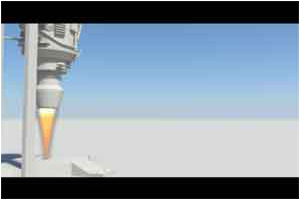

> Recovered from the [Wayback Machine](https://web.archive.org/web/20131217213124id_/http://davidlowelarsson.com/portfolio/jet-explosion/) — the portfolio page itself carries no publish date; dated to its journal counterpart (02 Aug 2009) on the old WordPress site. Lightly reformatted; images preserved.

**Project Name:** Jet Explosion
**Software used:** Maya, After Effects, Photoshop
**What I did:** Everything

## My first fluids explosion

This was a school project where the aim was to make and explosion, so that's what I tried to do.

During this project I tried hard to use particles and fluids in interesting ways just for learning purposes. This project really peaked my interest in dynamics and I learned that making simulations of real events isn't as easy as it seems.

The jet engine was a lot of fun to model. I tried to give it a lot of details to enhance my modeling. I also practiced some rendering. I used several cameras and used batch rendering together with scripting.

[Watch the video](https://www.youtube.com/watch?v=c-JUCOh65mQ)
