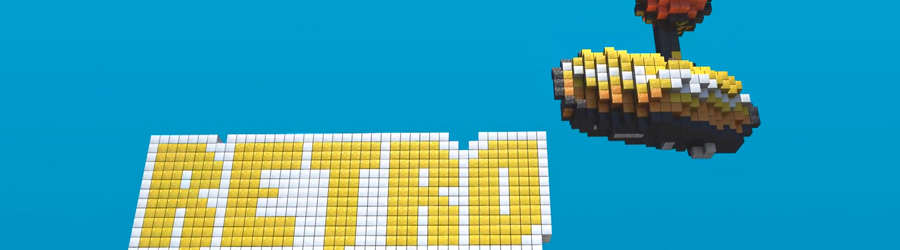

> Recovered from the [Wayback Machine](https://web.archive.org/web/20160802224839id_/http://davidlowelarsson.com/portfolio/retrospelsmassan-8-bit-ftw/) — the portfolio page itself carries no publish date; dated to its journal counterpart (23 Mar 2011) on the old WordPress site. Lightly reformatted; images preserved.

**Project Name:** Retrospelsmässan 8-bit
**What I did:** Everything

## working for free = working with freedom

A friend of mine started to have the annual conference of retro games. It has had a real uprising and have grown a lot these last couple of years. The second year he was planing it he asked me if I couldn't make a trailer of some kind.
Read the breakdown [here](http://davidlowelarsson.com/retrospelsmassan/)

[Watch the video](https://www.youtube.com/watch?v=ljArdprq-QY)
