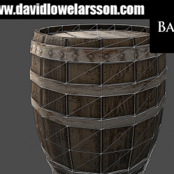

> Recovered from the [Wayback Machine](https://web.archive.org/web/20150629105816id_/http://davidlowelarsson.com/barrel-study/) — originally published 11 Aug 2013 on the old WordPress site. Lightly reformatted; images preserved.

## studying assets to improve my skill

Here is a study of a barrel, pleased with it. Not much more to say =)

[Watch the video](https://www.youtube.com/watch?v=THVFOJdhjQU)
