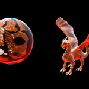

import YouTube from '../../../../components/YouTube.astro';
import videoPoster from './feature.png';

## CGFX straight to the Engine

When working with a proprietary engine I wanted to get a look at the finished result inside Maya before exporting the mesh. Most engines solve this by working as an editor and an engine. But at my studio that wasn't the case at the time of writing, so I set out to create a tool were I could create assets in Maya without the need to start the engine whenever I had made a change to my textures or model.

I started by using a CGFX shader inside Maya, then I wrote a GLSL shader to match. Instead of creating a CGFX shader from scratch I used one that can be found online. [Leonardo Covarrubias](http://blog.leocov.com/) have created a really nice one which I ended up using.

Although I found several others I have to mention Kostas Gialitakis and his great work. Visit his site for more information, [Kostas](http://www.kostas.se). I really feel that I need to try his shaders out in the future, but for this exporter I used Leonardos shader in Maya.

I started off by creating a regular Phong shader inside the engine, then built it up from there. The more complex shaders might not be as efficient as they could be, but at this point that wasn't the goal. The main goal is to get a correct representation inside Maya so that the artists don't have to start the engine every time they make a change. When getting in to the more complex variations of the shader I also started to solve some things a little different from how the CGFX shader worked, most notably the glow effect.

The glow works like a clean add inside the CGFX shader. I decided to use it as self illumination in GLSL, it also respects the alpha in the texture. The reason for this was mainly because it felt more logical for me.

<YouTube id="PUBQvz_dP18" title="CGFX and GLSL glow comparison" poster={videoPoster} />

I then continued working on the material exporter. As stated above, I wanted the artist to be able to move their work into the engine. So the shaders I had written needed to be connected to the materials that were assigned to the meshes. The exporter checks the CGFX shader for all the attributes and then creates an XML formated material that the engine can use. Depending on what's being used in the CGFX shader it also assigns the most suitable GLSL shader which then results in a exact copy inside the engine.

I created some videos showing some comparisons between the CGFX in Maya and the GLSL copy inside the engine. This tool and tools like it is a must for any artist working with realtime. To see the actual mesh in realtime, inside the artists tool, is incredibly important for a coherent and beautiful result. It's especially important when doing tweaks and small changes to the material or textures, without the need to start/restart the engine.

When I continued creating more and more complex shaders I also realised the difficulty to prepare for every situation. Sometimes it's hard not to create a certain shader just for that special case, but creating the most common shaders and then using them over and over is just a necessity and it's great when you have a preview look inside your tool and you know that it will look exactly the same inside the engine.

<YouTube id="NaFxesQ4Lzw" title="CGFX and GLSL material comparison" poster={videoPoster} />
