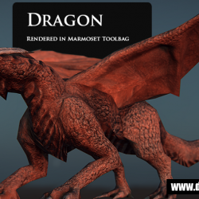

import YouTube from '../../../../components/YouTube.astro';
import videoPoster from './feature.png';

## at last I've finished him

Read my previous post [here](http://davidlowelarsson.com/dragone-wip/).

This is a project that has been put on the shelf far too many times, now I've finally found the time to finish him.

It's really fun animating a quadruped, especially with wings. There's a lot of secondary action that you can find and I hope he looks as good in game as he does in realtime view in Maya. I have worked with dDo and marmoset to finish the textures and create the last renders.

Marmosets incorporation into dDo is really amazing, although it's really heavy on the memory. dDo can be a bit clumsy if you don't have a machine that can handle the heavy lifting, so working on my notebook while traveling can be a little challenging. Skyshop in dDo is really nice but sending it over to marmoset still gives you the most amount of options when rendering. The only other caveat I have is that it's hard to move between machines when working. When using Modo you only need to start the program and it gets your license after logging in, on any machine anywhere in the world. I guess I'm just a little spoiled after that experience.

I would like to test it out in Unity though, what I've read is that it's really impressive so it would be fun to test out soon.

<YouTube id="2tcs7vpUBlg" title="Dragon animation" poster={videoPoster} />

The one and only thing in retrospect is the wings. The rigging and modelling of them made it very difficult to fully retract them, I might go back and redo them somewhere down the line, although I think it would be more fun to create a bird instead and really get it looking good. Maybe something rendered so that it's photo realistic.

I've really got to work on the textures and he's only around 6300 polygons, including eyes and teeth. I used CGFX shaders on him in Maya and then also got him into Marmoset for some nice shots. The only thing that's not realtime is the fluid when he breaths fire. I really wanted some nice looking fire and have had success with Maya fluids, It really turned out good.

You can see a early test with the flames in this separate video clip.

<YouTube id="B8vGuhu_0m0" title="Dragon fire test" poster={videoPoster} />

Well well, It's been fun creating the dragon and I hope you guys like it.

<YouTube id="508U_Fmi_9Y" title="Finished dragon render" poster={videoPoster} />

Here are some renders from Marmoset that came out really nice. I really like the sub surface scattering effect or translucency effect on the wings.
