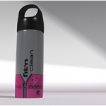

> Recovered from the [Wayback Machine](https://web.archive.org/web/20160803022108id_/http://davidlowelarsson.com/fit-n-clean/) — originally published 15 Apr 2013 on the old WordPress site. Lightly reformatted; images preserved.

## smell like sweet, Not!

[Fit n' Clean](http://www.fitnclean.se/) is a company creates a laundry detergent that is specilized towards training clothes.

I was asked late a sunday evening if i couldn't create a mashup of several designs into one coherent design. The job had to be done fast or not at all.

I came home around 24:00 and was finished at 03:00, the project was fun and it was also for a friend so I decided to forfeit some sleep and get it done.

As mentioned before there wasn't really time for any fiddeling with render options or getting the best light, so i created a basic studio environment and gave it about five test renders and then I started pushing out the real renders. The shots came out nice, a bit basic but nice. I would love to get my hands on Vray or Maxwell and give another go, I'd also love a computer that really has the power to give those fast test renders so that you really can dial in the best light and material.

## They wanted more!

Then the work continued, I was asked to do another bottle design. More of the final version. The time frame was a little short but mainly because I already was juggling several projects.

The second design really came out nice so I decided to test a animation, the product takes care of sweat and smells from clothes, so I decided to make the bottle sweet to really make the message clear. The next step is probably to make some kind of explosion where all the sweet flies off, or something similar. But this time around I was content with the camera animation and the droplets just dripping down the surface of the bottle.

I also tried out Vray for the new animation. Vray is really straight forward compared to Mental ray. I can see why it's so appealing to people. With very little effort I could get out really nice pictures compared to all the fiddling that's almost always required with Mental ray. I'm not saying that Mental ray is bad but using Vray was definitely a pleasant experience.

[Watch the video](https://www.youtube.com/watch?v=AHIMeeMw9z8)
