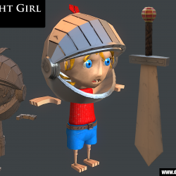

> Recovered from the [Wayback Machine](https://web.archive.org/web/20150629110015id_/http://davidlowelarsson.com/knight-girl/) — originally published 04 Aug 2013 on the old WordPress site. Lightly reformatted; images preserved.

## A small knight, who's a girl

Here is a quick and project, I was asked to do a worksample, which became this image.

I really liked the concept so I brought it into Maya and worked it into a full 3D character.

I really like how the character turned out and I'm looking forward to animating her when I get to it.
