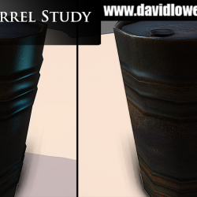

> Recovered from the [Wayback Machine](https://web.archive.org/web/20150629105833id_/http://davidlowelarsson.com/oil-barrel-study/) — originally published 08 Sep 2013 on the old WordPress site. Lightly reformatted; images preserved.

## studying assets to improve my skill

Here is a study of a oil barrel, came out nice. I used Modo for the modelling to sharpen my skills a little.

[Watch the video](https://www.youtube.com/watch?v=h2kNv1LUoNo)
