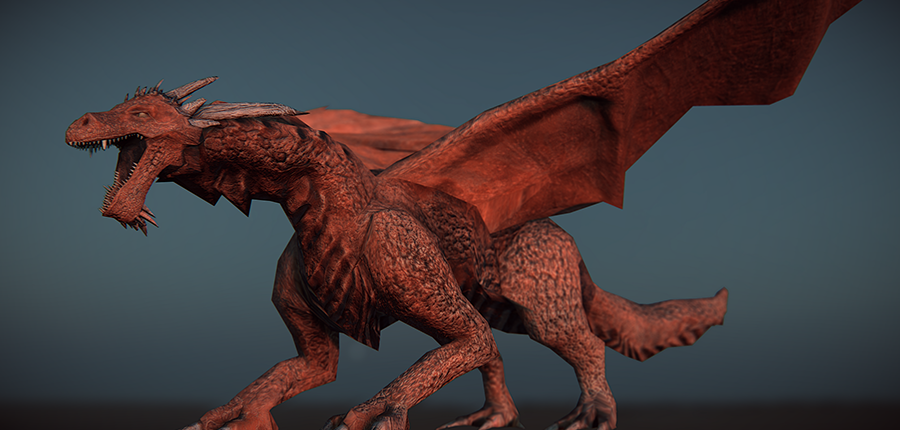

import YouTube from '../../../../components/YouTube.astro';
import videoPoster from './feature.png';

**Project Name:** Dragon
**What I did:** Everything

## Fly birdie Fly!

At last it's complete

The journal entry is [here](/posts/dragon-final-post/)

<YouTube id="508U_Fmi_9Y" title="Finished dragon render" poster={videoPoster} />

<YouTube id="2tcs7vpUBlg" title="Dragon animation" poster={videoPoster} />
