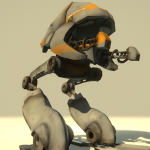

> Recovered from the [Wayback Machine](https://web.archive.org/web/20150629105701id_/http://davidlowelarsson.com/robot-mech-_001_/) — originally published 14 Mar 2013 on the old WordPress site. Lightly reformatted; images preserved.

## Mech _001_

The robot is a project that I have been working on when ever I have had some time over. I wanted to hard surface model something and it became this mechanical monster. The modelling process has been very straightforward, mainly just extruding and moving verts. It's been a good distraction from the day to day routine. When the model is ready for texturing i'm going to try and texture the whole thing inside mudbox.

The form and silhouette was of great importance to me in this project. Getting an appealing and good looking model is of course important aswell, but i wanted to see how far I could push the form and still keep the model tangible.

The texturing and sculpting method has also been pretty straight forward as well. Just pushing and pulling and then choose a color and apply, then repeat

The texturing process inside Mudbox was very rewarding, seeing your progress at once and immediately knowing if something works or not without reloading textures or starting other programs. During my texturing process I did discover Quixels new plugin for Photoshop [dDo](http://quixel.se/ddo/), It's really impressive although it's still buggy and often crashes. But when it works I must say I'm impressed.

Although I did finish the texturing and used [marmoset Toolbag](http://www.marmoset.co) to render him. I did however have a great deal of trouble to get the animations to work inside marmoset. There seems to be something in the way for it to work, I even tried several different ways but nothing worked. So I decided to recreate the animations inside Unity instead.

Animation has been a great exercise. Getting him to run and fall over and shoot has been great. The next step is to incorporate him inside Unity, making him run around and also getting him to look as good as in Marmoset will probably be a challenge.

[Watch the video](https://www.youtube.com/watch?v=h1sj6g5aouc)

Below is also a movie showing the model in wireframe

[Watch the video](https://www.youtube.com/watch?v=4hQNaa_1VVU)
