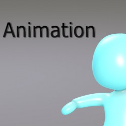

> Recovered from the [Wayback Machine](https://web.archive.org/web/20160803050059id_/http://davidlowelarsson.com/skl-kid-animations/) — originally published 12 May 2013 on the old WordPress site. Lightly reformatted; images preserved.

## SKL Kid Animation

Some simple but nice animations of a character. He turned out so cute =)

[Watch the video](https://www.youtube.com/watch?v=tsd0XgfsR4o)
