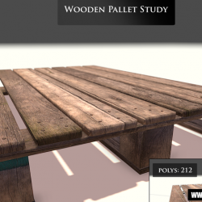

> Recovered from the [Wayback Machine](https://web.archive.org/web/20150629110121id_/http://davidlowelarsson.com/wodden-pallet-study/) — originally published 30 Sep 2013 on the old WordPress site. Lightly reformatted; images preserved.

## studying assets to improve my skill

Here is a study of a wooden pallet, more Modo training.
