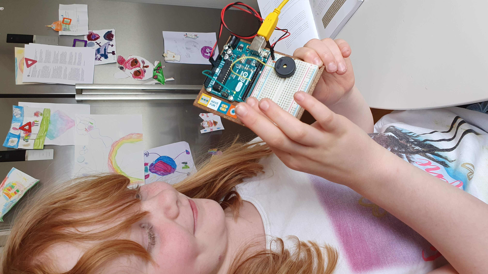

import Video from '../../../../components/Video.astro';
import arduinoDemoPoster from './20200524_130559.jpg';
import arduinoDemoPoster2 from './20200512_195530.jpg';
import tableImage from './20200731_153322.jpg';
import partsImage from './20200521_214438.jpg';

When corona spread to Sweden (where I live) I went to the office and brought home the Arduino stat kit that I had bought for the office. We usually have Lab Fridays at work, which is a day to learn more about "that thing you don't have time to fix/learn about"

  
  

## The kids were skeptical (and still are)

So when I brought the kit home the kids were really excited and really wanted to start, **experimenting!**

I quickly realized that I hadn't managed expectations properly. The hardware was fun, both for my 5 year old and 9 year old. Although the wait to write code, compile and then upload (and then again and again if we had bugs 🐛) was not really something children felt like a good way to spend their time.

So I needed to change my approach...

## New approach

So for me it's important that learning is fun, but to get to the fun I find that a base of knowledge is usually needed. So for my children to get the base I started to find the things that they found fun. My nine year old usually wanted to do all the hardware building. So I started to make deals with her, if she wrote some of the code I would help her and she would get to do most of the build. Which worked.

## Take away learnings

The last part that I'm still trying to get in place is maybe a deeper knowldge and learning when we've done all the fun stuff. I haven't really succeeded here, so my thought is to flip it all a little. Maybe start with the build, what are we building? why does it work? and how does it work?

we'll see how this will work ... time will tell 😁

<Video
  src="2020/building-with-children/20200521_214444.mp4"
  poster={arduinoDemoPoster}
/>

<Video
  src="2020/building-with-children/VID_20180427_111949.mp4"
  poster={arduinoDemoPoster2}
/>

