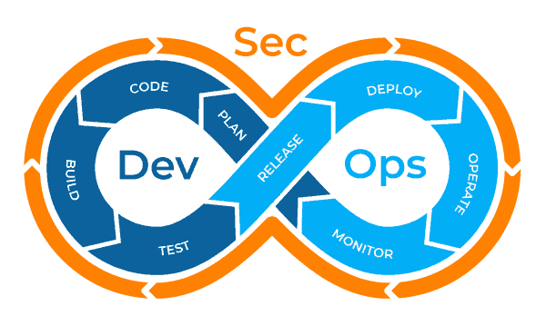
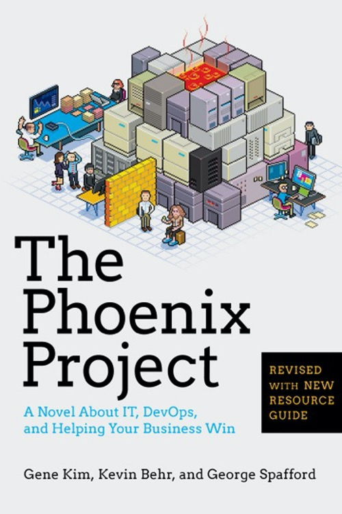

> Disclamer:  
> These are my thoughts from brain to keyboard.

## What does DevSecOps mean for me?

I've been curious since I were young. Everything that I could screw apart was always in danger of being just that 😁

The curiosity has always been guiding me, when I didn't know something I usually didn't read about it or asked anyone. I tinkered.

I tinkered and learned, when I knew enough then I started to read and learn more. Mostly that's how I still do most of my work. when I heard "fail fast" for the first time I knew that I was working in a way that suited more people than me.

I've also always loved linux moto "make it work, make it right, make it fast" which means, for me, that there is always several steps to create something (like this blog post). First just do it, then go make and make it better and finally polish it and make it the best it can be.

DevSecOps (Is an abbreviation of Development, Security and operations. Coined by Patrick Debois in 2009, who became one of its gurus.)

So for me DevSecOps is something that brings those growing instincts together. It lets me create something (with lots of fails on the way), it lets me make it better (hopefully secure and stable) and finally it lets me polish my work and push it to something that will perform and deliver.

Deliver? Deliver to whom?! Well that might be the whole point with any process, but DevSecOps is a great enabler, for the users. The ones that are going to use our product, connect to our service or whatever it might be. In some instances it might just be one user (like when I tinker something for myself), in other instances it might be few users (like the ones that read my blog posts 😊) and in other instances it might be tens of thousands (or even millions) of users like the services I build at work.

The users are the whole point, they want something that works, if it doesn't they want it fixed **quickly**.

They want something that is easy ( some might say user friendly), if it isn't they want it fixed **quickly**.

They expect something that is fast, secure, reliable, manageable, lives up to their expectations etc. etc. and they want it **quickly.**

As you might have guessed, the whole point of DevSecOps is to move fast, maybe a better word is efficient 🤔. The 6 months release cycle is not working anymore, not even the two week sprint release. The way of the world has changed and the users and we (as developers) expect improvements, change and feedback at the same pace.

## Summer inspiration

As many others, I read the [phoenix project](https://play.google.com/store/books/details/Gene_Kim_The_Phoenix_Project?id=qaRODgAAQBAJ) this summer without putting it down, well almost 😀.

The book gave me some answers to things that I have done instinctively and background to other processes that I do consciously. It's really a great read and I'm starting on the [unicorn project](https://play.google.com/store/books/details/Gene_Kim_The_Unicorn_Project?id=kNSSDwAAQBAJ) now. But what the book gave me most of all is this quote:

> "Experimentation and risk taking are what enable us to relentlessly improve our system of work, which often requires us to do things very differently than how we’ve done it for decades."

For years the different aspects of velocity and speed for development and the stability and maintainability for operations have never worked together in my eyes.

There has always been a push and pull, and always a hint of blame responsibility in all discussions between them (who will carry the responsibility and be focus of the blame when something goes wrong). When things brake and something takes time or there's some kind och blocker. All these things has always been in the way for the flow for "planned work" to actually get done

But with DevOps this actually works! it's incredible. Even security, maintainability, quality comes into the mix without much friction and most, if not everyone, sees the benefits. Operations is happy, Development isn't hindered (but also buy in to the extra responsibility this entails). The book reminded me of where I was not that long ago and gave me happiness for where I find myself now, but also such hope for the future and what might be possible very soon.

## What can DevSecOps mean for others?

### The Company

  
Where I work there were a deploy fear when I started.

Some people were comfortable with the process and had done it several times before.

But when that person was gone deployments were a painstaking long checklist and super scary. The process entailed a checklist and every project (we had around 5-10) was deployed differently. The checklists were never or at least very seldom up to date. When something went wrong there was little to no documentation or procedure to fix it.

I remember that one of the deploys scripts had a skull when it was time to push to production, that was how sinister it could feel ☠

This created an atmosphere where it's nice to push deploys into the future and do them even more infrequent. Which of course creates bigger deployments with even more changes and the impossible task of error searching when something goes wrong. Which happened more than once.

For the company this entails very few deploys per year, I think we did **maybe** 1 per two weeks (when we didn't  delay them when even more) when I started. So the business gets new features at a slow pace and usually not the feature that they had anticipated or requested. The feedback loop were super slow, so new features needed a really long time to get right.

This also created a greater risk of deployments which could create uptime issues if we are really unlucky, this made the end users unhappy and we would risk loosing them to another service.

For the company DevOps, or DevSecOps, means frequent changes, continuous deployments and things like tests, security and quality is all part of the deployment pipeline.

This creates a system that is self checking and developers can (usually ... things brake in the pipeline sometimes as well) rely solely on the pipeline. So forgetting to run the integration tests is ok, the pipeline will do it for you. If something goes wrong it will stop and save the users from any bugs or similar in production.

### The Teams?  

A team that utilises DevSecOps can usually concentrate on "planned work", as it's called in the Phoenix project book. What this means is that outages, firefighting and curveballs is not something that needs to be dealt with everyday. The systems and the process help the teams keep focus on their planned work and be able to minimize multitasking (hopefully there is no need for it).

In my view this creates a less stressed work environment in general. Which has nothing but good side effects.

I remember when I started there weas a really friction and irritation when someone asked for help or interrupted someone, this might have been related to a lot of other things as well. But over the years when the process has evolved and the systems have matured, the general stress levels have gone down. With process in place and the trust in the systems this has at least removed most if not all stress related to deployments, security, quality etc. etc.

The above has also been adopted and built while we have moved towards a more agile way of working. Kanban and scrum, we use them both depending on project/team. So the amount of queue time has been reduced and the throughput has increased, and the things being done is more of the things the business is asking for. But we also make time for tech debt, quality and security which should be valued just as high as features and business tasks/tickets

### The Users

As I mentioned at the beginning, the most important aspect is what this means for the users? In my opinion DevSecOps means that the users gets features and a product within their expectations. They get changes and updates more frequently but also a more reliable and secure product.

The feedback loop between users behaviour (this can be qualitative or quantitative) and the changes being deployed are shortened. Which in turn grows user retention and a better user experience in general.

The developers and users also grow closer because the changes that's being made, if we measure it, can easily be seen and discussed. This creates motivation and a sense of accomplishment that really can't be seen in the "waterfall" way of working.

## What could DevSecOps mean for your users?

So why do I think everyone else should buy into DevSecOps?

Well the give away might be in the headline 😃 , your users.

The value you create is not the money that a company makes, that's just a side effect, the real value is **user happiness** and DevSecOps helps create that in a completely revolutionary way ... imo 😂 .

This has been a journey for me, waterfall to agile and now agile together with devsecops. I'm looking forward to the next part of this journey, maybe the unicorn project is the thing that starts the next part 🤔
