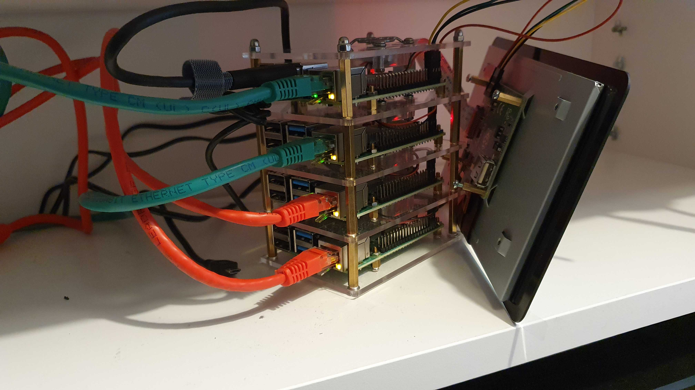
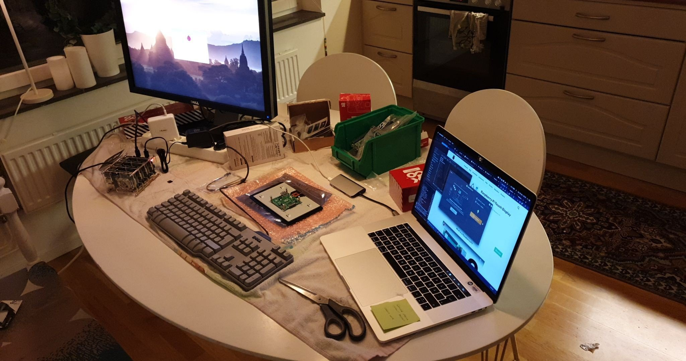

*Raspberry Pi cluster and screen*

I can't live without some kind of server ... and one Raspberry Pi felt way to simple for all the crazy projects I have planned 😋

So it was time to downsize. Time to get rid of the big server I have in my closet and time to try a cluster of Raspberry pi's to handle the current workload and more.

## First steps

I started to look into k3s a while back, a minimal kubernetes deployment. We have been running Rancher (a full fledged tool for managing several kubernetes clusters. From the company with the same name, Rancher) at work for a couple of years. I've really like the opinionated way everything is set up and that makes it easy to get started. Everything is solved for you but if you really want to change anything, you can.

I started fiddling around with a k3s cluster (the smaller/optimized kubernetes version for "edge" solutions) on raspberry pi 3 B+ and got fair way on my own.

Because k3s was relatively new when I started and the documentation didn't cover my use case. It was difficult and time consuming to get started, opposite to my experience with Rancher.

But when I learned about Sheldon's work, a field engineer that works at Rancher. He had started a home project, doing almost the same thing, a raspberry pi cluster that uses k3s. I started to rethink my implementation. I read through his github repository and started from scratch. It really lifted my project to a level where I wanted it - [https://github.com/Sheldonwl/rpi-travel-case](https://github.com/Sheldonwl/rpi-travel-case)

\> Thanks Sheldon! 😁👍

What I first learned that the first steps are the most important and getting that wrong can really mess everything up if you don't do them properly. But Sheldons work was a great help and something that made it much easier to get started.

I was just looking to replace my current server (which hasn't happened yet) but that meant I didn't need the carry case or led's and the other "extra stuff". But I did buy 4 X Raspberry Pi 4's, sd cards, a touch screen and a fast SSD for storage. That seemed like a great beginning, later I also added a USB power supply instead of using four separate power supplies.

When I had all the hardware I started the setup. My goal was to have a rancher master server to manage the Kubernetes cluster and, at a minimum, spin up:

-   A blog (like this one)
-   Owncloud or Nextcloud (Mostly as a nice alternative to Google / Microsoft)
-   Plex (for all my old movies, series and music. Although I hardly use it 😆)
-   Openfaas (Great project to run functions as a service which I wanted to try out)

My goals are and will be a little ambivalent, because with what I've learned from the setup is that arm architecture is a lot different from x86. Almost nothing works out of the box, and if it does work ... it still needs a lot of configuration.

## Why not use the cloud?

So why would I choose to use arm and a couple of underpowered raspberry pi's instead of just buying cloud time or a more powerful NUC? or a smaller "real server"?

well, my short answer to that would be. It's not as fun 😉.

The longer answer would be - Using a Linux distribution is closer to a real server. Raspberry pi's are fun to fiddle around with in general. Working on simple and "underpowered" machines also gives me a good idea of how things will work in an environment that isn't optimal. In short, I learn so much more.

Raspberry Pi's aren't that far from the specs a mobile phone or tablet has today. This means that I will get a real picture of how something would perform on a device that matches the type of device that everyone has in their pocket.

Another thing is that arm architecture is something that usually all modern software won't run on, at all.

This forces me to either learn more around the software and build it myself. Which might not always be an option, That forces me to look for work arounds or other solutions ... and in most cases i land in a final solution that works better than the original. Something that runs on arm is usually much more optimized, which gives me a better final solution.

... and really Raspberry Pi's arent really that underpowered anymore 📈

## Next steps

My next steps for the cluster is to have more workers and a HA (high availability) master solution.

I also need somekind of redundancy, if I need to change or do anything with my whole cluster I want everything to continue working. Im not sure how to go about this in a "home setup" just yet, i might just have a cloud cluster or another raspberry pi setup.

I would also like to look into a loadbalancer that can send traffic to any one of my workers that I have (Today my router can't really handle any advanced use case)

it was fun to tinker this project and I look forward to the next iteration. But maybe I need to update my work station 😁

*Working in the kitchen*
