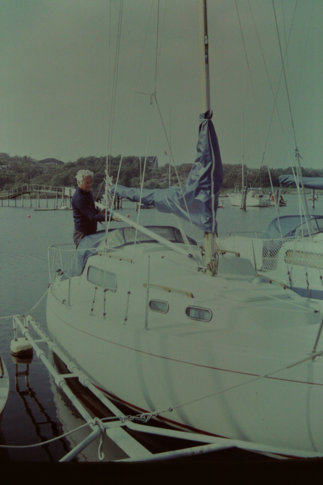
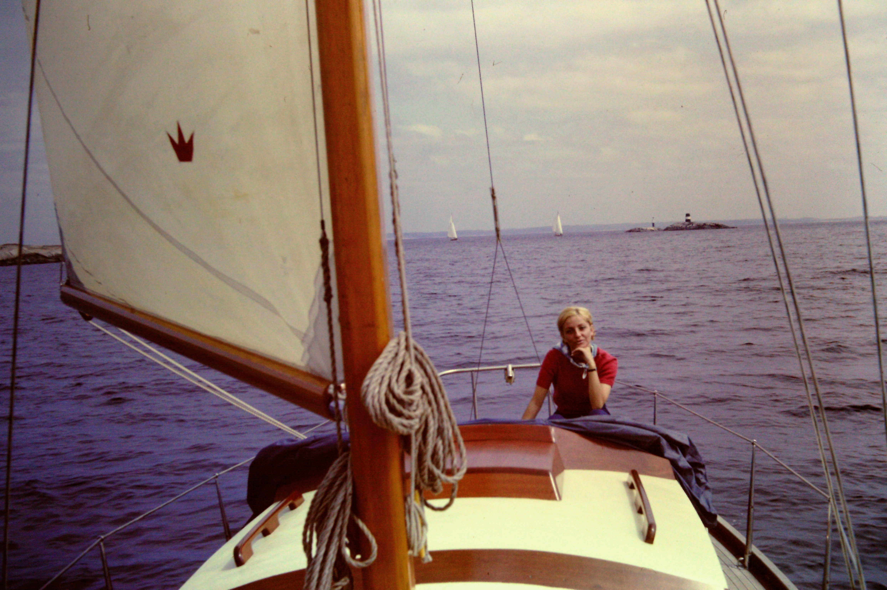
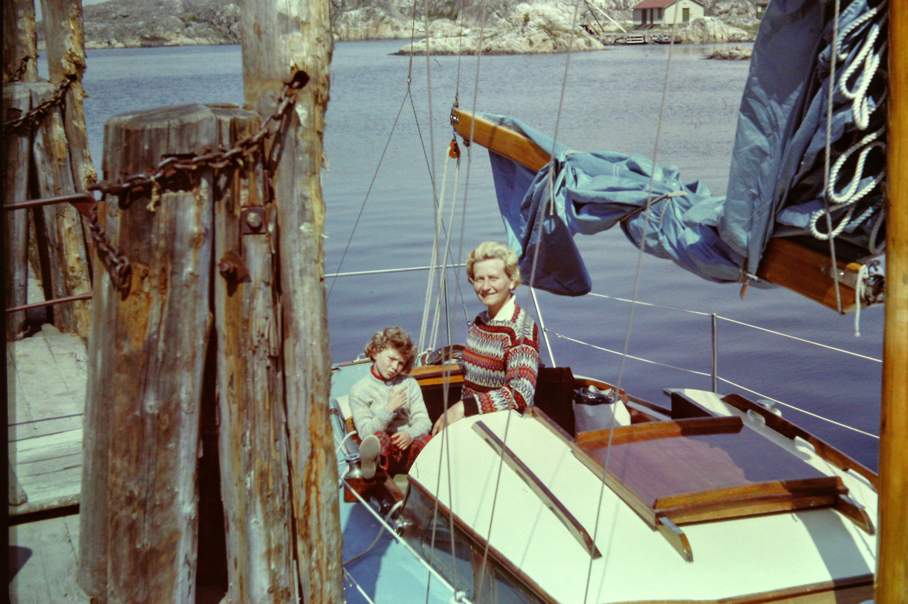

Just nu håller jag och min fru på att ta både "Förarbevis" och "Kustskepparen".

Vi har lite olika erfarenhet, min fru har följt med någon gång på en segelbåt och åkt motorbåt lite på sommaren. Jag växte upp med att min morfar hade segelbåt och att vi varje sommar seglade i bohusläns skärgård.

Min morfar var e ganska cool kille. Han jobbade inom polisen hela sitt liv, från ridande polis till SÄPO (säkerhetspolisen). Han hittade seglingen och förde det vidare till min mamma och som tillsammans förde det vidare till mig. Det är en helt fantastisk aktivitet. Varje segling är ett äventyr, man upptäcker nya platser och utforskar världen.

I bilderna ser man min morfar, mormor (moster), samt min mamma.
