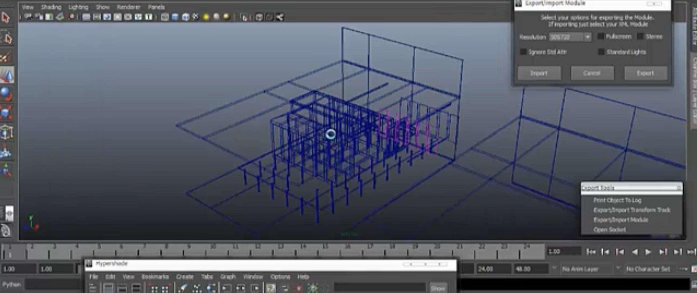

When I rebuilt this site in Astro I started digging through backups of my old websites, trying to
find the posts and projects I had left behind. Which made me opening a lot of old pages and watching videos I had not
seen for years. It's really "cringe" (as my daugther would say), but I also don't want that work to be buried or forgotten just because it is old. It is
still fun, and it is part of my history.


Two of the things I found were tools I built around Maya, Python, XML, CGFX and GLSL. Watching
those videos again reminded me of the line on the start page of this site, where I say that
"somewhere along the way, building the tools became the craft" (hope fully it's still there and I haven't changed it when you're reading this 😅). I think these tools were part of
that "somewhere".

## The "long feedback loop"

We were building a real-time walkthrough of a data centre and its cooling system. The scene had a
lot of small parts, many with their own materials, and all of them needed to end up in the right
place as one complete scene. The engine ran mainly on Linux while the me and other artists worked in Maya on
Mac and Windows, so testing the actual result was awkward and time-consuming.

Before the tool, objects were exported and then placed by editing XML manually. A change could
mean exporting the individual objects, objs, again, updating the XML, moving over to the engine and
finding out what was wrong. Going back and forth could take several hours, which made it very
easy to loose "flow".



So I built a Python importer and exporter that could move the scene between Maya and the engine's
XML format. It handled groups, objects and materials, but it also had to translate how the two
applications represented orientation. Maya used rotations while the engine expected look-at and
up positions, so the script created temporary locators and constraints to do the conversion. It
was not particularly elegant, and I even wrote "don't ask me why" about the engine format in the
original post, but it did shorten the feedback loop, "was i correct?".

The [Maya Scene, Python to XML](/posts/maya-scene-python-to-xml/) project handled placement and
scene structure. The [CGFX and GLSL](/posts/cgfx-and-glsl/) project attacked the same delay from
another direction, giving artists a close preview in Maya of how materials would look in the
engine. The preview could never replace testing in the real engine and there was always some
final polish, but most mistakes could be found where the artist was already working.

Most 3D posts in the archive are simply finished projects, they don't need a platform-engineering
lesson. These two just made part of my work journey easier for me to see.

## I called it automation

When I moved into web development I kept trying to shorten the same kind of round trip. At Delta
Websolutions, Jenkins became central to that work, and I brought a lot of those ideas with me to
UR. At the time I mostly called it automation: put shared logic in one place, add the checks once
and make it easier for every project to get the same behavior, including things like security
scanning. Almost treating the build pipeline like a "lib" for all projects.

Jenkins also taught me where that approach became hard to maintain. Groovy, shell commands and
layers of escaping could turn a simple command into a small puzzle. I still have an example where
preserving quotes around a variable needed six backslashes... eventually the shared workflow was
creating its own friction. The shortest version looked something like this:

```groovy
sh 'echo "$BUILD_NUMBER"'      // 1, quotes silently dropped
sh 'echo \\"$BUILD_NUMBER\\"'  // "1"

def foo = 'bar'
def command = $/echo \\\"${foo}\\\"/$
sh command                     // \"bar\"
```

As Github actions, Drone and Circle CI appeared, I became more interested in smaller, modular
parts that could be replaced.

## Removing the deploy button

Removing the "deploy button" has been one of my goals since I started at UR ... merge a feature
and let it reach users. As long as it's in a feature branch or jira ticket, it dosen't bring any user
value.

Today that work includes GitOps, preview applications and progressive delivery on Kubernetes. A
change can go through unit, integration, end-to-end and smoke tests, get a final sanity check with
k6, and then move into a canary rollout. Argo Rollouts can use metrics such as latency and server
errors to decide whether a new version should continue or roll back, while the developers get a
signal quickly when something fails.

Some services still have a manual promotion step, so that is progressive delivery. Others have
taken the step to continuous deployment, where a healthy version is promoted by the system and a
failing one is rolled back without a developer needing to press a deploy button. Production is
still the final environment, just as the Linux engine was, but the path to useful feedback is a
lot shorter and more of the repeated checking has been encoded into the system.

I did not have the language of platform engineering or feedback loops when I wrote those Python
scripts. I was trying to get a data-centre scene out of Maya without spending hours placing it by
hand again. There are probably more pieces of this transition hiding in the archive that I have
not found yet... I look forward to seeing what else turns up.
