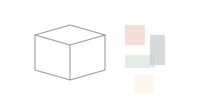
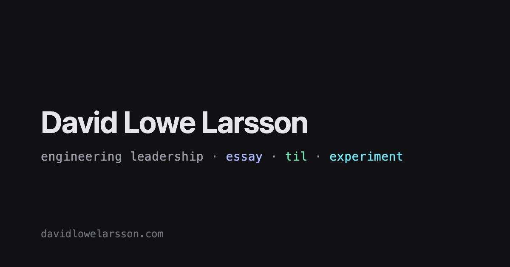

> **WIP/TEST** — placeholder content while the site's design is under construction.

For about a decade, before infrastructure paid the bills, I built 3D scenes. Renders, rigs,
lighting setups, the occasional short animation. I didn't think of it as engineering practice.
It turns out it was — just for a different kind of pipeline.



## Two pipelines, one shape

A 3D production pipeline and a software delivery pipeline rhyme more than I expected. Both move
raw material through a sequence of transformations — modeling, texturing, rigging, lighting,
rendering, compositing on one side; commit, build, test, deploy, observe on the other — and both
live or die on how well the *handoffs* between stages work, not how good any single stage is in
isolation.

### The render farm was my first platform team

Before I knew the term "platform engineering," I was the person who set up the render farm: a
pool of machines, a job queue, a way to distribute frames across nodes and reassemble them into a
finished sequence. Artists submitted jobs. My job was to make submitting a job boring — no
manual file copying, no "which machine has the right plugin version," no surprises at 2am before
a deadline.

That's platform engineering. Different substrate, same job: reduce the cognitive load of the
people doing the primary work, and be invisible when it's going well.



That workbench — half art tool, half ops console — is the clearest artifact I have of the
transition already underway before I had a name for it.

### What breaks in both worlds

> A render that fails at 90% and a deploy that fails after the health check passes cost you the
> same thing: trust in the pipeline, which is much more expensive to rebuild than the job itself.

The failure modes even feel similar:

- A texture reference pointing at a path that only exists on one artist's machine — the same
  shape as a config value that's only set correctly in one engineer's `.env` file.
- A render that looks fine at low resolution and falls apart at full quality — the same shape as
  a service that works under a light load test and buckles under real traffic.
- A pipeline stage that silently succeeds while producing garbage output — the same shape as a CI
  step that exits 0 despite the actual check never running.

## What carried over directly

| 3D production skill                     | Platform engineering equivalent                  |
| ---------------------------------------- | -------------------------------------------------- |
| Version-controlling scene files          | Version-controlling infrastructure as code         |
| Render farm job scheduling               | CI/CD runner scheduling and concurrency limits      |
| Asset dependency graphs (textures, rigs) | Service dependency graphs and build caching         |
| "Bake" steps (lighting, simulation)      | Build/compile steps that trade runtime cost for prep cost |
| Frame-by-frame QA before a deadline      | Progressive rollout and canary checks before a release |

## The part that didn't carry over cleanly

Artistic feedback loops are slow and subjective by nature — a director's note like "make it feel
warmer" doesn't compile into a ticket. Engineering feedback loops can be fast and objective: a
test either passes or it doesn't. I had to unlearn some patience for ambiguity that served me
well as an artist and would have made me a slow, hedge-everything engineer if I'd kept it
unchecked.

A small example of the instinct I had to actively override — treating "it looks right" as
sufficient evidence, instead of writing it down as a check:

```ts
// artist instinct: "I looked at it, it's fine"
// engineering habit: encode the check so it survives without me looking
test('preview build has no draft posts in production mode', async () => {
  const posts = await getVisiblePosts({ showDrafts: false });
  expect(posts.every((p) => !p.data.draft)).toBe(true);
});
```

## Why I think the move made sense

Both disciplines are, underneath the specific tools, about designing systems that let other
people do good work without having to understand every layer beneath them. A lighting artist
shouldn't need to know how the render farm schedules jobs. A developer shouldn't need to know how
the deployment pipeline provisions its runners. Good platform work in either domain is the same
craft: absorb complexity so it doesn't propagate to the people depending on you.

I don't render scenes for a living anymore, but I still think in pipelines, dependency graphs,
and "what happens when this stage fails at 2am" — because that's the muscle a decade of production
work actually built, whatever the tool set looked like at the time.
