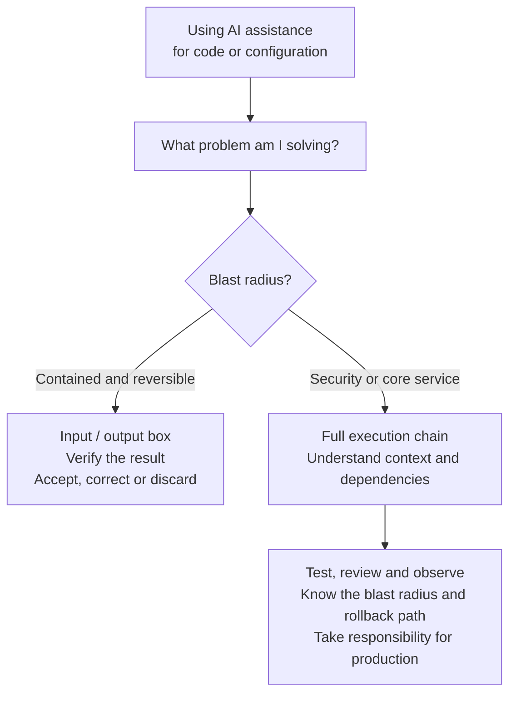
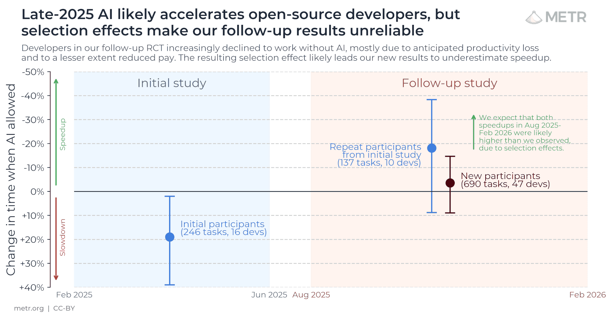

On Friday I read Dalia Abuadas's GitHub post [The cost of saying yes has
changed](https://github.blog/engineering/the-cost-of-saying-yes-has-changed/). She describes the
first patch as a price check rather than the finished product, which reminded me of a presentation
I held earlier this year and one experiment I used as my bad example.

I started by changing the testing framework, not really knowing where I would end up, then added
types and did a whole lot of refactoring. It became three dependent pull requests that had to
merge in order, changing 330 files with 10,221 lines added and 7,842 removed. Everything passed
and everything looked good... we could probably have merged it 😅.

But I don't think that would have been responsible. No one would have had the knowledge or the
understanding to compare my monster change with what was already in production and working that
day. My note on the presentation slide was, "We can't responsibly put this into production. (I
think)". I had made the mess myself.

## TL;DR

- A generated patch can make the real cost visible, but it is not automatically the product.
- I give AI more freedom when I can verify the output and the cost of a mistake is small.
- The problem and its blast radius matter more to me than who, or what, wrote the code.
- Tests and rollback paths help, but ownership still stays with a human.

## When the output is enough

I use AI for a lot of reading. It can gather context from documentation, issues, logs and code,
then help me find the part that needs my attention. When the result is a summary or an internal
integration with a small blast radius, I am mostly concerned with the input and the output. If a
daily digest is slightly wrong I can correct it, and nobody's main service drops off the internet.

This website is another example. I probably would not have tried Astro and deployed it this fast
without AI helping me read the documentation, write code and work through unfamiliar parts of the
framework. But it is also a useful boundary: the source is public, the tests are visible and a bad
change can be rolled back. I still review the work and often ask another model for a second
opinion, but experimenting here does not carry the same risk as taking down a main streaming
service. If I worked at a bank, changing the transaction or login system would sit at the other
end of that scale.

That difference matters more to me than whether a piece of code is "AI-generated". I try to start
with "what problem am I solving?", and how much risk sits around that problem. The diagram below
is about the times I use AI assistance for code or configuration. I still write both without AI
sometimes 😁, and those changes go wrong too. The blast radius does not care how the mistake was
made.

## Owning the chain

The three pull requests from my presentation were the opposite of that contained box. They were a
test migration and an API contract change spread across thousands of lines, and each pull request
had to merge in the correct order. The agent could produce the changes, but it could not make the
review fit inside a human head. Understanding and insight into the code became the bottleneck.

At the time I also showed the [METR study of experienced open-source developers](https://metr.org/blog/2025-07-10-early-2025-ai-experienced-os-dev-study/),
where 16 developers working on 246 real issues took 19% longer when AI tools were allowed. The
developers still believed they had been faster, but METR now says that result, based on early-2025
tools, is out of date.

Their [2026 follow-up](https://metr.org/blog/2026-02-24-uplift-update/) is even more interesting to
me. Some developers did not want to participate because they did not want to work without AI,
which probably made the measured speed-up smaller. The pay had also dropped from $150 to $50 per
hour, and developers running several agents at once could not reliably say how much time one task
took. METR calls the new signal unreliable, so the chart can point towards acceleration without
telling us exactly how much. The way we work is changing quickly enough that measuring the change
has become difficult too.

*METR's follow-up estimates point towards a speed-up, but the confidence intervals and selection
effects leave the size uncertain. [Source and methodology](https://metr.org/blog/2026-02-24-uplift-update/), CC BY.*

For work with a larger blast radius I try to make the change small enough that I can understand
it, keep the public contract intact, add or update tests and know how to turn it back. A feature
flag helps when there is one, but it is not a substitute for understanding what happens after the
flag is enabled. The agent can write the smallest code change, list every file it touched and run
the tests, but it does not own the result and it does not get called when the code needs
maintenance next year (at least not yet).

The [Linux kernel policy for AI coding assistants](https://docs.kernel.org/process/coding-assistants.html)
makes that ownership unusually clear. An AI agent must not add a `Signed-off-by` tag. A human
reviews the code, certifies it and takes responsibility for the contribution. The fact that Linux
now accepts AI-assisted code at all feels like a milestone, a fairly strong signal to the rest of
the coding world that this way of working is here to stay... while the human signature stays
exactly where it was.

I can hand more of solving the problem to an agent, Ansible, GitHub Actions or another part of the
pipeline, but I cannot hand them the responsibility. We are creating services, applications and
tools for other people, and a human still has to own what happens when they fail. My exact
boundary will probably move as the tools and our safeguards improve... how we solve the problem
will keep changing, but I don't think ownership moves with it.

## Links

- [DORA 2025: AI as an amplifier](https://dora.dev/research/2025/dora-report/)
- [The cost of saying yes has changed](https://github.blog/engineering/the-cost-of-saying-yes-has-changed/)
- [METR's early-2025 developer productivity study](https://metr.org/blog/2025-07-10-early-2025-ai-experienced-os-dev-study/)
- [METR's February 2026 follow-up](https://metr.org/blog/2026-02-24-uplift-update/)
- [Linux kernel guidance for AI coding assistants](https://docs.kernel.org/process/coding-assistants.html)