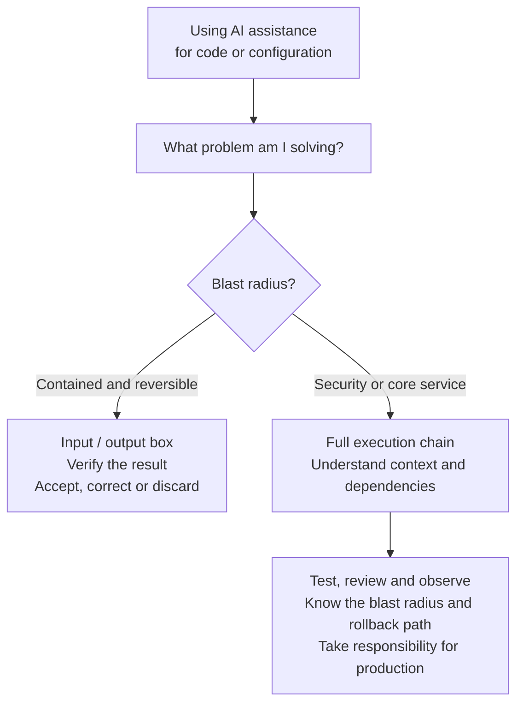

import MediaAside from '../../../../components/MediaAside.astro';
import metrProductivityEstimates from './metr-productivity-estimates.svg';

This Sunday I read Dalia Abuadas's GitHub post [The cost of saying yes has
changed](https://github.blog/engineering/the-cost-of-saying-yes-has-changed/). She describes how saying no was easier at the idea phase before .. while it's now so easy to create a prototype/test/draft of a feature that it's almost better to test things and get a good idea of how complicated something is and then discuss if we want to do it for "real".
Her subject is how AI now helps a lot (and sometimes doesn't help), which reminded me of a presentation
I held earlier this year and one example I used, how we might not want to use AI when working 😅.

My example was a big refactor, introducing typing, changing testframework which resulted in three, dependent, pull requests that had to
merge in order. I had changed 330 files with 10,221 lines added and 7,842 removed. All tests passed, linting looked good, everything was typed, everything looked good... we could probably have merged it.

But we never did. We discussed it in the team and I don't think that would have been responsible. No one would have had the knowledge or the
understanding to compare my changes with what was already in production and working. I had a note on the slide I was presenting, which read, "We can't responsibly put this into production. (I
think)". I made a mess and after it was tested, working and good .. we decided not to merge it anyway.

## TL;DR

- A generated change can make the real cost visible, but it is not automatically the product.
- I give AI more freedom when I can verify the output and the cost of a mistake is small.
- The problem and its blast radius matter more to me than who, or what, wrote the code.
- Tests and rollback paths help, but ownership still stays with a human.

## When the output is enough

When the risk is low and the output is the only artifact I care about, I care less about whether a piece of code is "AI-generated". I try to start
with "what problem am I solving?", and how much risk sits around that problem. The diagram below is my super simple abstraction on how/why I use AI assisted code generation.
I still write code both with and without AI
sometimes 😁, and those changes can go wrong, the blast radius does not care how the mistake was
made (if it was me or an agent).

I use AI for a lot of reading, research, checks and summarization. It can gather context from documentation, issues, logs and code,
then help me find what's important, which I can then focus on. When the result is a summary or an internal
implementation with a small blast radius, low risk, I am mostly concerned with the input and the output (if it works, it works, right 🤷). If a
daily digest is slightly wrong I can correct it, no users are affected or impacted by my mistake (or AI's mistake).

This website is an example. For this build I jumped into Astro head first, I've previously had lots of experience in React/Next.js and several other frameworks but never tested Astro.
Without AI helping me read the documentation, write code and work through unfamiliar parts of the
framework I wouldn't have been able to go from 0 to a deployed working site in a day, which I did with this. I still review the work and often ask another model for a second
opinion, but experimenting here does not carry the same risk as taking down the main streaming
service at work, or if I worked at a bank, changing the transaction system or login system and nothing would work after my change. That could lead to a lot of bad will and hassle if I messed that up.

## Owning the chain

<MediaAside
  src={metrProductivityEstimates}
  alt="Interval chart showing METR's early-2025 slowdown estimate and two uncertain late-2025 speed-up estimates"
  side="right"
  caption="My simplified view of METR's estimates. Both follow-up intervals cross no change, and selection effects make the real speed-up difficult to measure."
  sourceHref="https://metr.org/blog/2026-02-24-uplift-update/"
  sourceLabel="Data: METR"
>
  Those pull requests are why I keep coming back to understanding. The agent had produced
  thousands of lines that passed all the checks, but no one in the team could realistically load
  the whole change into their head and compare it with what was already working. We had code,
  tests and types... but we didn't have anyone who could confidently own the whole thing.

  When I held the presentation I also showed the [METR study of experienced open-source developers](https://metr.org/blog/2025-07-10-early-2025-ai-experienced-os-dev-study/).
  They followed 16 developers working on 246 real issues, and the developers took 19% longer when
  AI tools were allowed. The really interesting part was that they still believed they had been
  faster. METR now says that result, based on early-2025 tools, is out of date... which is almost
  as interesting as the result itself.

  Their [2026 follow-up](https://metr.org/blog/2026-02-24-uplift-update/) became
  messy in a different way. Some developers did not want to participate because they didn't want
  to work without AI, the pay had dropped from $150 to $50 per hour, and people running several
  agents could not really say how long one task took while they were doing other things at the
  same time. METR calls the new signal unreliable. The chart points towards AI making the work
  faster, but the way we work has changed quickly enough that measuring how much is now difficult
  too.
</MediaAside>

I have seen parts of this shift before. In 2013 I wrote about [moving this site away from making
changes directly through FTP and into a Git workflow](/posts/git-the-new-svn/) (well not this site exactly in 2013 I think this was wordpress and PHP .. which it's not anymore 😉), and since then
more of the path has moved into virtual machines, containers, Kubernetes and GitOps. Every step
let me hand more repeated work to a system. None of those systems owned the service when it
stopped working though. AI might become another layer in that path... I'm not sure the comparison
holds all the way, but that part feels very familiar.

When the blast radius is larger I need a change small enough that I can actually understand it. I
want the public contract to stay the same, tests that show what should keep working, and a way
back when it doesn't. A feature flag helps, but it mostly makes turning the change off easier, it
doesn't explain what the change did. The agent can make the smallest patch, list every file and
run every check... it still doesn't get the call next year when someone has to maintain the code
(at least not yet).

The [Linux kernel policy for AI coding assistants](https://docs.kernel.org/process/coding-assistants.html)
makes this almost comically literal. An AI agent is not allowed to add a `Signed-off-by` tag, a
human has to read the code, sign it and take responsibility for the contribution. At the same time
the fact that Linux accepts AI-assisted code at all feels like a milestone to me. This way of
working is probably here to stay... but the human signature didn't move.

> The responsibility, ownership and knowledge is still Human, independent of how the code/application/thing was created.

I can hand more work to Ansible, GitHub Actions, an agent or whatever comes next. I can probably
hand over more than I am comfortable with today, and that boundary will move as the tools and our
guardrails get better. But when the service fails a human still gets the call... I don't see that
changing yet.

## Links

- [DORA 2025: AI as an amplifier](https://dora.dev/research/2025/dora-report/)
- [The cost of saying yes has changed](https://github.blog/engineering/the-cost-of-saying-yes-has-changed/)
- [METR's early-2025 developer productivity study](https://metr.org/blog/2025-07-10-early-2025-ai-experienced-os-dev-study/)
- [METR's February 2026 follow-up](https://metr.org/blog/2026-02-24-uplift-update/)
- [Linux kernel guidance for AI coding assistants](https://docs.kernel.org/process/coding-assistants.html)