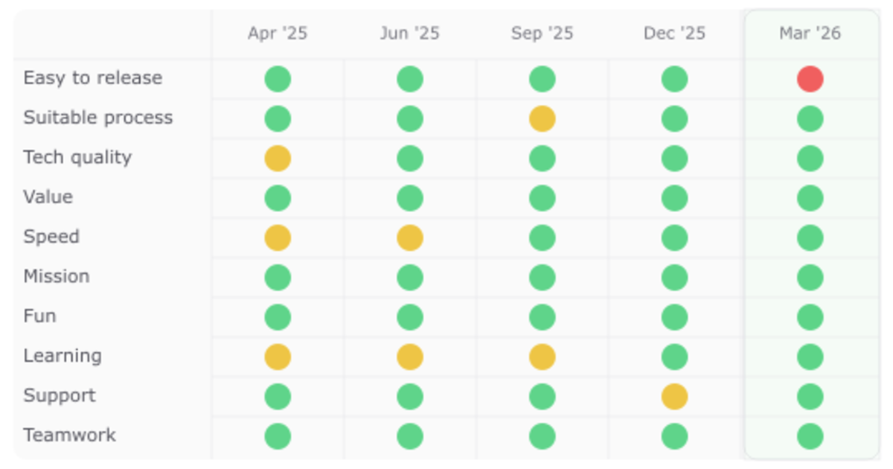

We run a team health check with some teams at UR, ten attributes that everyone rates green, yellow or red, and
I've been doing it for years now. A while back one of the attributes went from green to red, and my
first reaction was that something had broken... so we talked about it, and it turned out nothing had
got worse at all. What had changed was us. We had quietly raised what we count as good, and the old
green didn't qualify anymore. That's a strange sort of good news, and it's the clearest evidence
I've had that the small iterative improvements were actually landing 😄

*Five quarters of health checks. Easy to release, green all the way through... and then red.*

## TL;DR

- A health check attribute went from green to red and nothing had actually got worse. We had raised
  what we count as good.
- Velocity, burndown, burnup, DORA: every one of them is useful right up until somebody sets a
  target on it.

So I like DORA metrics, mostly because of what sits behind them. There's real research under those
five numbers now (the 2026 model replaces MTTR with Failed Deployment Recovery Time, aimed at the
same recovery question but narrowed to failed deployments, and adds Deployment Rework Rate), and
what it keeps finding is that the places where delivery health is good are also the places where
people are happier at work. That matches everything I've seen. It's also why deployment frequency
reads as a real signal to me and not a productivity score, because a feature that isn't deployed
is just dead code, and dead code isn't giving any user a better day.

## The velocity years

Velocity came first for me. I used it for years to explain to teams, to stakeholders and to bosses
what we could reasonably take on, and it worked really well for as long as it stayed a
conversation. Then somebody sets a target on it, and the usefulness just dissipates... the number
keeps going up and it stops meaning very much. Burndown and burnup went the same way, and I can't
think of a single one of these instruments that survives being turned into a goal. We were running
health checks in that same period, which is probably why the health check is still useful all these
years later. Nobody has ever tried to set a target on "Fun" 🙃

## What we measure now

The wiring is a lot more competent these days. Deployment data comes out of the GitOps releases and
the CI, the alarms come from the uptime monitoring we already run, the ticket flow comes from the
issue tracker, and it all lands in one place through an open source DORA dashboard (there are
several to pick from, DevLake is one). Written down like that it sounds finished, and it really
isn't. It's still getting to the point where I would trust the numbers, and it isn't in front of
the teams yet, because a number I can't defend is worse than no number at all.

Which is worth holding next to where this started. When I wrote [the unexpected value of Dev Sec
and Ops](/posts/dev-sec-and-ops/) in 2020, we deployed maybe once every two weeks and often
postponed that, every project deployed differently, the checklists were out of date, and one of
the deploy scripts had a skull in it for the production step ☠ The posts land six years apart on
the calendar, but the change I'm talking about happened over roughly five of them, and now the
deploy button is mostly gone and the pipeline decides. I'm not going to quote a change failure
rate yet, but I don't need a dashboard to tell me which of those two worlds I'd rather be on call
in.

I remember another version of that fear from when I reworked [sturebadet.se](https://sturebadet.se/).
The payment service had a debug environment, and when we switched over and went live in production,
no payments worked. The client was waiting with champagne and we were about to celebrate, and I was
mashing at the keyboard like a monkey/cat and hoping I was fast enough to solve it. We did finally
solve it... but it was a stressful hour, and exactly the kind of release I don't miss.

## What the numbers can't see

The health check reaches things DORA has no view of at all. Two of the ten attributes make the
point on their own. "Easy to release" is where the two overlap, and it's the one a delivery
dashboard would also tell me about. "Learning" is the one it never will, and a team with no time
to learn anything can look completely fine in a delivery dashboard for quite a long while. So
asking people what they actually think, and then having the discussion that follows, matters at
least as much as the data, because data with no purpose attached is just a dashboard somebody
opens now and then.

And there's a newer doubt I keep coming back to. If AI writes more and more of the code, and the
code gets cheaper to produce, then a lot of what we used to measure gets less interesting, and
what's left worth measuring is whether any of it reached a user and stayed up. I wrote about [who
owns the code AI writes](/posts/essay-ai-code-ownership/) from the ownership side, and this is the
same question from the delivery side... measuring the application itself, and not only how fast we
ship it, so we don't end up crushing out features while the downtime quietly climbs. I don't have
that part measured yet 🤔

## Links

- [DORA research and capabilities model](https://dora.dev/), the five delivery metrics, what predicts them, and the outcomes they tie back to
- [DevLake](https://devlake.apache.org/), one of the open source DORA dashboards worth looking at
