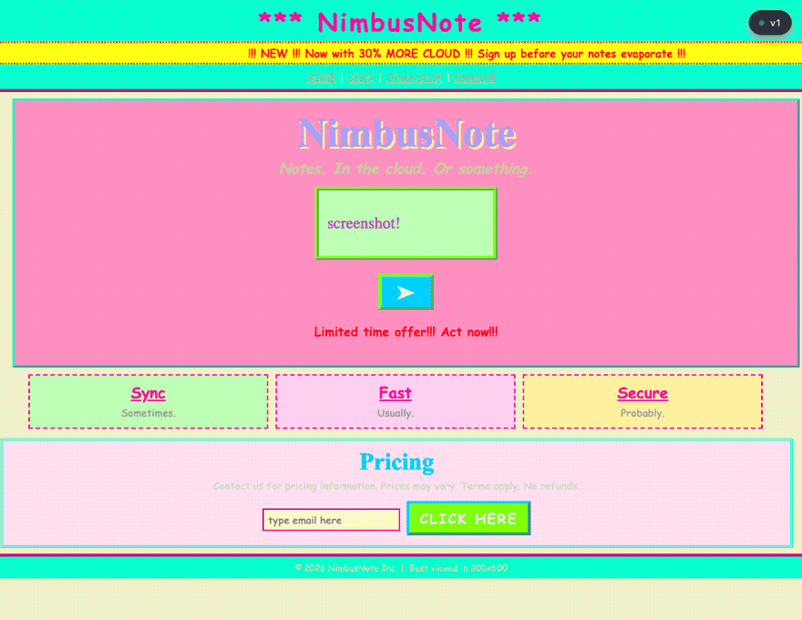
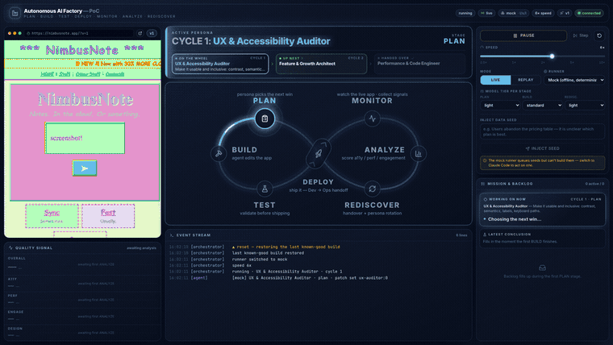
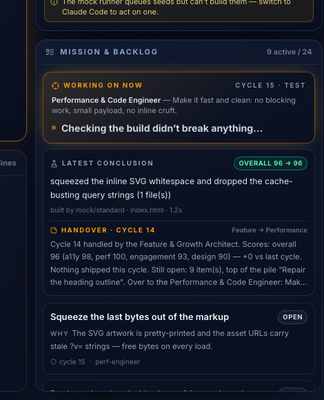
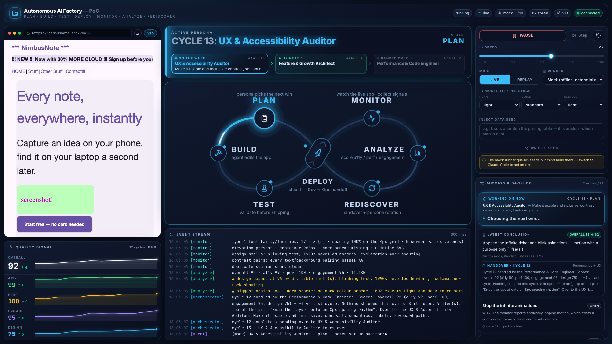

This afternoon I demoed a one-day proof of concept to my colleagues... an AI
factory that takes the classic DevOps infinity loop and removes the humans from
the turning of it. Well, not entirely. A human still steers, but the cycles run
themselves: plan, build, test, deploy, monitor, analyze, rediscover, and around
again.

*Every visible improvement in there maps to a git diff.*

The idea comes from a couple of places. Harvard Business School calls it the
[AI factory](https://online.hbs.edu/blog/post/ai-factory), software that turns
data into decisions in a loop where each cycle's output feeds the next cycle's
input, and Cloudflare recently built
[an agent that triages incoming GitHub issues for Astro](https://blog.cloudflare.com/astro-issue-triage/)
before a human ever looks at them
([here's one in the wild](https://github.com/withastro/astro/issues/17763)).
I wanted to **see** that loop turn, literally, on a screen share. So I built one.

## The loop

The factory evolves a landing page for a fake notes app called NimbusNote, three
files, `index.html`, `styles.css` and `app.js`, made deliberately horrible at the
start. Comic Sans. A 21-color clashing palette, 1.3:1 body contrast, `
`
tags, a busy loop that runs at parse time. Quality score at v0: 24 out of 100.

The seven stages are drawn as the DevOps figure-eight with deploy at the
crossing, right where "release" sits in the original logo. And the boring stages
are real. TEST actually parses the HTML and syntax-checks the JS and rolls back
on failure, and MONITOR actually measures contrast ratios, payload bytes and
heading structure.

Three personas take turns at the wheel, one full cycle each... a UX and
accessibility auditor steering toward Material Design 3, a growth architect who
wants one obvious action on the page, and a performance engineer whose favorite
change is deleting things. Each persona ends its cycle by writing a handover,
what it did and what the next persona should care about, and every backlog item
carries a why the planner can point to, a measurement or a user report. Fifteen
cycles in, the same three files score around 97.

*One backlog item. The why field is the part I'd keep even if I threw the rest away.*

The demo beat everyone liked was typing feedback straight into the loop. Anyone
can inject a sentence as a seed, and seeds outrank planned work. I typed "make
everything rose red, really red, super red" and watched planning turn that into
concrete steps, down to file names and which CSS custom properties to change,
and 84 seconds later it was deployed and on screen. Even the hardcoded SVG fills
that bypass the design tokens got caught, which surprised me.

And when a build overran its 300 second budget the factory killed it, rolled
back so nothing half-built shipped, and told me why in plain language before
retrying next cycle. That part I'd want at work.

## The analyzer lied to me

The most valuable bug of the day was in the measurement itself. While testing I
injected "make everything green" and the agent obliged. The result had dark text
on dark green, genuinely unreadable. The accessibility score? 100.

So what happened... the analyzer only measured one contrast pair, body text on
body background. Everything else was invisible to it, and that made it invisible
to the UX persona too (I think this is the real lesson, the agents' plans are
only as good as the evidence they get). A loop with weak instruments kept
telling me everything was fine.

*The analyzer after the fix, naming the smells it can now actually see.*

The fix was surprisingly mechanical. Material Design 3 pairs every container
color with an on-color, so the monitor now checks every token pair and every
section's text against its background, in both light and dark schemes. The same
green page scored 61 after that, with the failing selector and both hex values
named in the next plan's evidence. Next time I'd audit what the agents can
actually perceive before letting them loop, I think.

## What broke

Plenty, and I like these stories more than the score graph. The mock demo-runner
claimed credit for work it didn't do, marking user seeds "done" while applying
unrelated canned patches. So it got an honesty gate, nothing counts as done
unless files actually changed.

Worse... every live planning step was silently discarded for hours, because the
CLI wraps its output in a JSON envelope the plan parser never opened. Builds
kept happening anyway, improvising instead of executing plans, and I only found
it because a colleague said the backlog looked unclear.

And the safety guard that reverts stray agent edits outside the sandbox happily
reverted my own uncommitted files too 🙃. Autonomous cleanup needs a baseline of
what was already dirty before the run.

The part I enjoy most is that the factory was itself built the same way, by
orchestrated AI agents working in parallel for a day, test-first, about 475
tests at the end. So the demo is basically a small version of how it got built.

## Where this goes

The backlog is the pluggable part. Today it's analyzer findings and typed seeds,
tomorrow it could be an issue tracker like in the Astro setup, or support
tickets. The next thing I want to try is a release gate where any persona can
veto a deploy and the veto's reasoning gets written down, so the next cycle can
read why and not do it again. I'm not sure how well any of this scales past a
demo... we'll see, time will tell 😁

## Links

- [The AI factory](https://online.hbs.edu/blog/post/ai-factory), Harvard Business School's framing
- [Improving Astro's issue triage with Cloudflare Workers](https://blog.cloudflare.com/astro-issue-triage/), the triage bot
- [An Astro issue triaged by the bot](https://github.com/withastro/astro/issues/17763)
