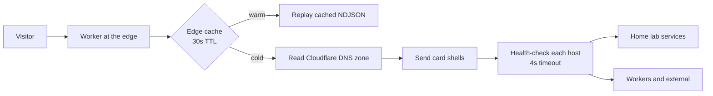

Everything I run at home sits behind a `cloudflared` tunnel, the way I set it up in the [home lab
topology post](/posts/experiment-home-lab-topology/), and for a while the index page listing all
of it was served from inside the lab too. Which is fine right up until the lab is the thing that's
down, and then the page that's supposed to tell me what's down is also down 🙃

So the dashboard moved out to a Worker on Cloudflare's static assets, and the DNS zone became the
registry. The Worker lists the zone, keeps the records whose comment carries a `dash` marker (the
same [record comments I'm using as a tiny metadata DB](/posts/til-dnsendpoint-cloudflare-comments/)),
renders a card per hostname and health-checks each host. The lab being unreachable stopped being
an outage of the dashboard. It's a red card.



## The caching turned out to be the experiment

Reading the zone on every request means every visitor, plus anything polling the summary endpoint
for a status tally, turns into a Cloudflare API call carrying my token. That's a neat way to
rate-limit myself, with my own dashboard as the attacker... So the public view goes through
the edge cache with a 30 second TTL, and the refresh button is debounced so that leaning on it
can't force a recompute more often than every 10 seconds.

```js
const CACHE_TTL = 30; // seconds the public registry is cached at the edge
const MIN_REFRESH = 10; // min seconds between forced recomputes (debounces the refresh button)
```

The authenticated view can't use that cache at all, because private cards depend on who is asking.
Cloudflare Access injects the signed-in email as a request header, and when that header is present
the response goes out `private, no-store` and never touches the shared cache. Two views, two
completely different caching rules, out of the same function.

## One dead host shouldn't hold the whole page

Health-checking every host before sending anything means the page waits for the slowest one, and
a service that is properly down waits for the full timeout. So the registry streams as NDJSON
instead, one JSON object per line: the card shells go out as soon as the DNS read is done, then
each status pill lands the moment its own check resolves, then any `og:image` that turns up. Every
check has a 4 second timeout, and anything that times out or answers 5xx is simply down.

There was one gotcha I didn't see coming. The Worker owns the apex route now, so a plain
`fetch()` from inside the Worker back to its own hostname is a same-zone self-fetch, and Cloudflare
answers with error 1042 instead of looping. The asset lookups had to go through the static assets
binding instead of over the network. Obvious afterwards, and not at all obvious in the
moment.

## Where stale is actually fine

Minutes of staleness is usually fine for me, which is exactly where a content site lives, and
where Astro is good at this. Anything that needs direct feedback doesn't really suit this shape at
all. At work we have the opposite problem, a very big Next.js application with around ten services
that all need their caches cleared when something changes, so we built a cachebuster: a Kafka queue
we can work through until every cache that needs clearing has been cleared. It works pretty well
actually, and it's a lot more machinery than two constants 😅

What this doesn't solve is the original thing I went looking for. The dashboard tells me a host is
down, it doesn't serve the missing thing from a cached copy, and I still like the idea of a Worker
holding the last good response for a content site. The 30 seconds and the 10 seconds are also just
numbers I picked, not numbers I measured... time will tell whether they're the right ones.

## Links

- [saltast.com](https://saltast.com)
- [Workers static assets](https://developers.cloudflare.com/workers/static-assets/)
