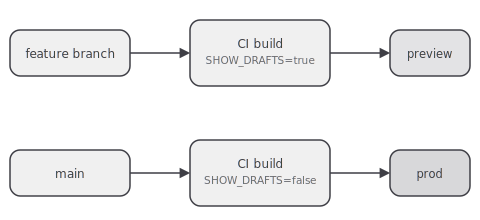

> **WIP/TEST** — placeholder content while the site's design is under construction.

This site needed a way to preview draft posts without leaking them into production, and without
maintaining a second copy of the content. The answer ended up being one environment variable and
two build targets off the same branch model.



## The branch model

Two paths out of every commit:

- A feature branch pushes, CI builds with `SHOW_DRAFTS=true`, and the result deploys to a
  branch-scoped preview URL on `workers.dev`. Drafts are visible there on purpose.
- `main` builds with the default (`SHOW_DRAFTS=false`) and deploys to the production domain.
  `isVisible()` in `src/lib/posts.ts` filters drafts out before any page is generated.

Same `astro build`, same content collection, one flag deciding which posts make it into the
static output. No separate CMS environment, no separate database of "which posts are public."

## Why a build-time flag instead of a runtime check

I considered gating drafts at request time — build everything, hide drafts behind a header or
cookie check in a middleware. Rejected it for one reason: a build-time filter means draft content
never exists in the production build artifact at all. There's no "forgot to hide it" failure
mode, because there's nothing to hide — it was never compiled into the pages that ship to
production.

## What the pipeline actually runs

```yaml
# CI, roughly
- run: npm ci
- run: npm run lint
- run: npm run typecheck
- run: npm run test
- run: SHOW_DRAFTS=true npm run build   # preview
- run: npm run build                    # production, drafts excluded
```

## What's still manual

Promoting a branch to `main` is still a normal PR merge — no auto-promotion, no scheduled
publishing. For a personal site with an audience of one very picky author, that's the right
amount of automation: enough to make previewing effortless, not so much that a merge button
becomes a publishing decision made by accident.
