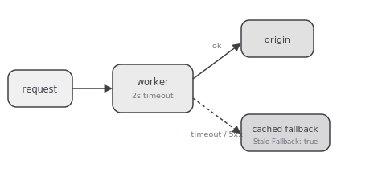

Running a small experiment: can a Worker sit in front of the origin and serve a cached, slightly
stale response when the origin is down, without adding its own failure mode on top of the one
it's supposed to cover?



## The setup

A route in front of the real origin. On each request, the Worker:

1. Forwards the request to the origin with a short timeout.
2. On success, returns the origin's response and stores a copy in the Cache API.
3. On timeout or a 5xx, serves the last good cached copy instead, with a `Stale-Fallback` header
   so it's visible in the response that this wasn't a live hit.

```ts
export default {
  async fetch(request: Request): Promise<Response> {
    const cache = caches.default;
    try {
      const originResponse = await fetch(request, { signal: AbortSignal.timeout(2000) });
      if (originResponse.ok) {
        await cache.put(request, originResponse.clone());
        return originResponse;
      }
      throw new Error(`origin returned ${originResponse.status}`);
    } catch {
      const cached = await cache.match(request);
      if (cached) {
        const fallback = new Response(cached.body, cached);
        fallback.headers.set('Stale-Fallback', 'true');
        return fallback;
      }
      return new Response('Origin unavailable, no cached fallback', { status: 503 });
    }
  },
};
```

## What I'm checking

- Whether the 2s timeout is short enough to feel like failover and long enough to not flap on
  normal origin latency spikes.
- Whether the Worker itself becomes the thing that's down — a bug in the fallback logic is a new
  single point of failure disguised as a reliability improvement.
- How stale is too stale for a cached fallback to still be useful instead of misleading.

Early read: the mechanism works. The open question is entirely about the timeout and staleness
thresholds, which is really a product decision dressed up as an infrastructure one.
