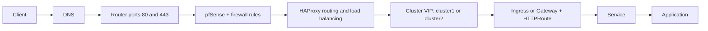
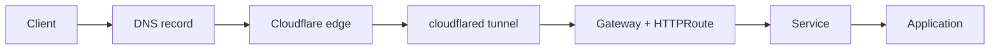

I wanted a boring outcome: publish a service, get a real URL, have it appear on the dashboard,
and avoid opening inbound ports on my home router.

The topology changed to match that goal. Instead of port-forwarding and hand-maintained routing,
Cloudflare handles the public edge, `cloudflared` holds an outbound tunnel from inside the
network, and DNS became the registry of what should be reachable.

## TL;DR

- I no longer decide cluster placement and routing up front before each deploy.
- I deploy where it makes sense now, then move services later if needed.
- Routing follows DNS and tunnel config, so moves are operational work, not redesign work.
- Apps can announce themselves via `external-dns`, so publish and registration happen together.
- Cloudflare is the implementation I use today, but the pattern is: edge + tunnel + DNS as source
   of truth.

## The shift that actually mattered

The big win was not "I use a tunnel now." The big win was removing placement anxiety.

Before, I had to know exactly where something would run and how traffic would split before I could
ship it. That made small experiments feel bigger than they were. A quick app stopped being quick
because every deploy dragged routing and topology decisions behind it.

Now I can deploy first, move later, and move back again if I want. As long as DNS catches up,
routing keeps working. That sounds small in theory and huge in practice. It means I spend less
time fiddling with IPs and ingress glue, and more time actually testing ideas.

| Before | After |
| --- | --- |
| Pick cluster first | Deploy where convenient |
| Hand-plan traffic split | Let DNS + tunnel route it |
| Moves feel risky | Moves become routine |
| Router config keeps growing | Router stays boring |

## Before vs after traffic path

This is the visual version of what changed for tunnel-served apps.

### Before

### After

In this "after" model, the app-side registration step is simple: the app config (via
`DNSEndpoint` and `external-dns`) announces the DNS record, and that registration is what makes it
show up in routing and on the dashboard.

The practical difference is that router forwarding, pfSense path rules, and HAProxy are no longer
in the request path for these services.

Security note: fewer exposed layers does not mean no security work. App auth, authorization,
patching, and cluster hardening are still required.

## What fought me on the way there

Short version: almost every failure was about control-plane assumptions, not raw network
connectivity.

The first rude lesson was that a healthy-looking gateway can still be dead in exactly the way that
hurts. My Kubernetes `Gateway` looked green and old routes still worked, but new ones silently
failed because the `GatewayClass` controller had vanished after a reboot.

The tunnel also had a moment. `cloudflared` wanted QUIC over UDP 7844, my firewall had no
interest in that arrangement, and then it tried IPv6. Forcing IPv4 plus HTTP/2 fixed it.

Then there was the part where a pod could not reliably reach its own gateway. The connector lived
inside the cluster, but the gateway behaved like a LAN-facing north-south entrypoint. The fix was
to let `cloudflared` leave through the node, hit the gateway VIP like an external client, and come
right back in.

The final gotcha was configuration authority. My tunnel was remotely managed, so the local
catch-all config was ignored and new DNS records returned 404. The fix was to set the catch-all in
the remote tunnel config, not as a wildcard public hostname that would hijack half the zone.

## What this buys me

- No inbound ports on the router for these services. The lab dials out; the internet does not dial
   in.
- One registry I can trust. If the zone says a service exists and is marked for the dashboard,
   the dashboard shows it. Experiments that don't route — archived projects, link-only write-ups —
   live in a small static list beside the zone, so a card can point at a repo instead.
- A cleaner publishing path. For the Kubernetes case, creating the DNS record is effectively the
   act of making the service public, while still letting me keep certain records out of the
   dashboard.
- An edge-hosted dashboard that can stay up and tell the truth even when the lab itself is having
   a bad day.

## What it doesn't solve

Closing the perimeter does not remove the need to secure what sits behind it. The tunnel protects
the network perimeter, not the services themselves. App auth still matters, and a compromised LAN
service is still compromised.

It also leans hard on Cloudflare. That is a real dependency, not an implementation detail. In this
case I am fine with that trade-off because I am explicitly choosing a boring home-lab edge over a
perfectly portable one. I am not permanently locked in, but moving away later would mean replacing
several conveniences at once, so that migration cost is real and should be acknowledged.

And there is still a little manual taste involved in the dashboard. DNS can tell me what is
reachable. It cannot decide what deserves a card, a title, or a nicer explanation. That part is
still mine, which is probably correct.

## The part I am keeping

The strongest idea here is not really the tunnel. It is that deployment and placement became
decoupled.

I no longer pre-plan cluster routing for every launch. I can deploy, observe, move it, and move it
back. If DNS stays current, the path still resolves.

The DNS zone is already the list of things I mean to make reachable. Once I accepted that, the
rest got easier to reason about: Cloudflare owns the edge, the tunnel carries traffic inward, the
gateway handles routing, and the dashboard reads from the one place that already has to stay
correct.

That feels like the right kind of homelab solution. Slightly over-engineered in the way that made
me learn something, but simple enough that I can still explain it to myself later without needing
an archaeological dig through old configs.
