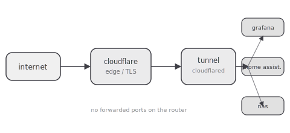
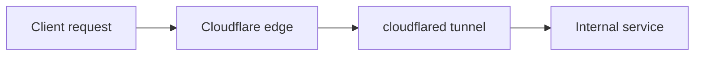

> **WIP/TEST** — placeholder content while the site's design is under construction.

My home lab has zero forwarded ports on the router. Every service that's reachable from the
internet gets there through an outbound-only tunnel, which turns "how do I expose this safely"
into a solved problem I don't have to re-solve per service.

## Why no port forwarding

Port forwarding means the router accepts inbound connections and hands them to something on the
LAN — every forwarded port is a hole in the perimeter that has to be individually reasoned about,
patched, and monitored. A Cloudflare Tunnel flips the direction: a daemon inside the network
opens an *outbound* connection to Cloudflare's edge and keeps it alive. Nothing on the router
needs to accept unsolicited inbound traffic at all.

## The path a request takes

1. A request hits a hostname on the zone, e.g. `grafana.example.com`.
2. Cloudflare terminates TLS at the edge and matches the hostname to a tunnel.
3. The tunnel daemon (`cloudflared`), already holding an outbound connection from inside the
   network, receives the request over that existing connection.
4. `cloudflared` proxies it to the right internal service by hostname and port, entirely on the
   LAN side.

## What this buys me

- One exposed surface (the tunnel daemon's outbound connection) instead of N forwarded ports
- Cloudflare's edge absorbs scanning and abuse traffic before it reaches home internet at all
- Adding a new internal service is a config entry in `cloudflared`, not a router change
- The router's WAN-facing attack surface stays exactly as small as an ISP modem with nothing
  forwarded

## What it doesn't solve

The tunnel protects the network perimeter, not the services behind it. Grafana still needs its
own auth, Home Assistant still needs its own auth, and a compromised service on the LAN is still
a compromised service — the tunnel just means an attacker has to get in through an application,
not through a scanned-and-found open port.
