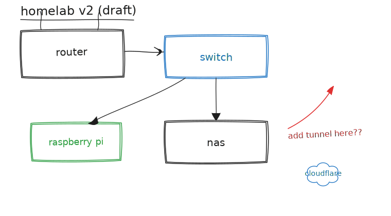

> **WIP/TEST** — placeholder content while the site's design is under construction.

This post is its own demo. I wrote it in Obsidian, sketched the diagram below in the Excalidraw
plugin without leaving the vault, and then copied both files into this repo exactly the way I'm
about to describe. If the sketch below renders — hand-drawn strokes and all, legible in both light
and dark mode — the pipeline works. That's the whole test.



## The strategy: frontmatter is the interface, not Obsidian

I don't want this site coupled to whatever note-taking app I happen to be using this year.  So the
contract isn't "posts come from Obsidian" — it's "anything that lands in
`src/content/posts/<year>/<slug>/index.md` with frontmatter that passes the zod schema publishes."
Obsidian is just the nicest place I currently have to write a first draft. If I switch tools next
year, nothing here has to change.

## Copy-on-publish, today

For now the flow is deliberately manual, because manual is one clipboard command and automation is
a maintenance burden I haven't earned yet:

1. Write and sketch in Obsidian, however messy that gets. Nothing in the vault is public.
2. When a note is close to ready, copy it — and anything it references — into the repo as a post
   bundle. Same shape as `templates/new-post`: a folder named after the slug, holding `index.md`
   plus its colocated images and diagrams.
   ```sh
   cp -r ~/vault/publish/homelab-v2 src/content/posts/2026/experiment-obsidian-pipeline
   ```
3. Open a PR with `draft: true`. CI builds a preview with drafts visible and drops the URL in the
   PR — I read the post on my phone the way anyone else eventually will.
4. Iterate against that preview URL by pushing more commits to the branch.
5. Happy with it? Flip `draft: false`, merge. Production picks it up with drafts hidden again.

If that ever becomes real friction — if I'm doing it often enough to resent the `cp` — the next
step is a dedicated `publish/` folder in the vault plus the Obsidian Git plugin (or a small sync
script) opening the PR for me. Not automating it yet, because I don't have the friction yet.

## Excalidraw sketches, exported as plain SVG

The diagram above isn't a screenshot and it isn't a React component — it's a `.svg` file, sitting
right next to `index.md`, referenced with the same relative markdown syntax as any other image:

```md

```

Getting there took one setting. In Obsidian's Excalidraw plugin: **Auto-export SVG**, same folder
as the sketch, background set to transparent. Every time I save the drawing, the plugin drops a
matching `.svg` alongside the `.excalidraw` source file. I copy that `.svg` into the post bundle
along with the markdown and I'm done — no export step, no "open in Figma to flatten it," no
client-side JS to render a canvas. Astro treats it like any other image: hashes it, caches it,
ships it as a static asset.

## The wiki-link trap

Obsidian writes internal links and embeds as `![[homelab-sketch.excalidraw]]` by default —
double-bracket wiki-link syntax that means nothing to a standard markdown renderer. Astro's
markdown pipeline won't resolve that; it'll either render literal brackets or silently drop the
image, depending on the day. Before anything gets copied out of the vault, every `![[...]]` has to
become a normal relative link: ``. It's a five-second
fix per image, but it's exactly the kind of thing that's invisible on `localhost` and only shows up
once a stranger opens the post with a vault-flavored plugin they don't have installed.

## The one rule I'm not automating around

Never point any sync script, git plugin, or CI job at the whole vault. Only ever at an explicit
publish folder. My vault has drafts, journal entries, half-finished rants about vendors, and notes
about people who did not consent to being blogged about. The entire reason copy-on-publish is a
deliberate, manual, one-directional step — instead of a live sync — is that a bug in a "sync
everything" script is a very different kind of incident than a bug in "sync this one reviewed
folder." I'm fine trading convenience for that boundary.

## What this proves

- A post with a colocated Excalidraw SVG renders in both preview and production — this post is
  that proof, and it ships with `draft: false`.
- The sketch stays legible in light and dark mode. Excalidraw exports dark strokes on a transparent
  background, which disappears against a dark page — Base.astro's global styles apply a CSS filter
  to any `img` whose `src` contains `excalidraw`, inverting it back to legible in dark mode without
  touching the SVG file itself.
- The README and the field guide now say all of this too, so future-me doesn't have to
  reverse-engineer this post to remember how the pipeline works.
