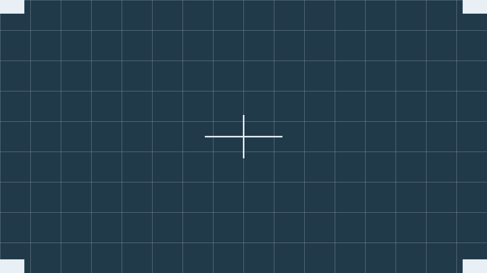
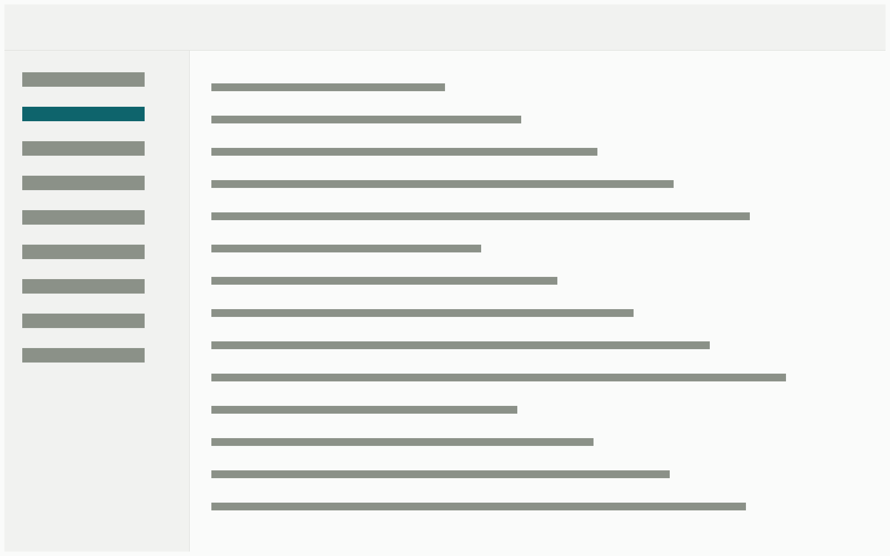
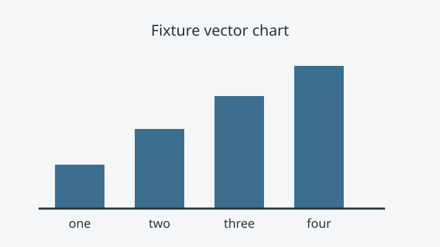
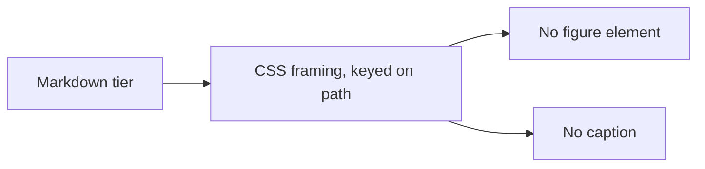

This is a fixture, not writing. It is the sibling of `kitchen-sink`, and it
exists for one reason: `.md` and `.mdx` do not go through the same processor, so
a fixture that only exercised one of them would be measuring half the site. Both
are `draft: true` forever, and `src/lib/production-build.test.ts` owns the
guarantee that a draft never reaches production.

This is the **Markdown tier** of the two-tier figure contract. Every image below
is plain Markdown syntax. They receive equivalent *framing* through CSS keyed on
the path, and they never become a `<figure>` and never carry a caption. That
limit is the contract's, not an oversight — the component tier is next door.

## TL;DR

- The same blocks as the component-tier fixture, in `.md` rather than `.mdx`.
- Plain Markdown images get framing, never a figure element and never a caption.
- A `.md` post reaches for no component at all; that is the common case, and the
  overwhelming majority of images on the site arrive this way.
- Nothing here is voice-bearing, and none of it reaches a reader.

## Prose blocks

### Headings run to three levels below the title

The Post title is the page's only `h1`, so everything inside the article starts
at `h2` and the deepest level any Post is expected to reach is `h4`.

#### A fourth-level heading, for the deepest case

Prose carries `inline code`, [an internal link](/posts/), [an external
link](https://docs.astro.build/), **bold** and *italic*. This paragraph is
deliberately long enough to wrap several times at the reading measure, because
the measure is only testable once a line actually reaches it.

### Lists, flat and nested

- A first item, short.
- A second item, long enough to wrap at the reading measure so the hanging indent
  of a wrapped list item is visible.
- A third item with children:
  - A nested item.
  - Another nested item, which itself has children:
    - A third-level item, the deepest nesting any Post is expected to use.

1. Step one.
2. Step two, long enough to wrap so the number stays aligned with the first line.
3. Step three, with nested steps:
   1. A nested step.
   2. Another nested step.

### A blockquote

> A blockquote is a distinct ground, not merely indented prose. It carries body
> text at the same measure.
>
> It can run to more than one paragraph.

### Code, inline and fenced

Inline `npm run verify` sits in the run of text. A fenced block does not:

```sh
npm run verify && gh stack submit --draft=false
```

A fenced block with a long line, which is the case that decides whether code
scrolls inside its own box or pushes the page sideways:

```ts
export function decideRender({ naturalWidth, containerWidth, baseLabelPx, floorPx }: RenderInput): RenderDecision {
  const scale = containerWidth / naturalWidth;
  return baseLabelPx * scale >= floorPx ? { mode: 'fit', renderWidth: containerWidth } : { mode: 'scroll', renderWidth: naturalWidth * (floorPx / baseLabelPx) };
}
```

### A table

| Axis | Mechanism | Values | Changes in this pass | Where it is decided |
|---|---|---|---|---|
| Layout | the breakout primitive | `.breakout` at 60rem | no | ADR 0006 |
| Kind | `data-media` | diagram, chart, screenshot, photo, sketch, embed | yes, new | the framing contract ADR |
| Placement | the side attribute | left, right | renamed | the framing contract ADR |

### A horizontal rule

---

Content resumes after the rule, so the rule's own spacing is measurable from both
sides.

## Images, as plain Markdown

A raster. It gets a multi-width `srcset` and lazy loading from the global image
config, and it opens in the lightbox — but it is an `` in a paragraph, not a
figure:



A screenshot arriving as a plain Markdown image. It gets the raster treatment,
because the Markdown tier cannot know a screenshot from a photograph — the path
is the only hook, and `photo` versus `screenshot` is deliberately not inferred
from a filename. This is the two-tier limit showing its edge: to get the
screenshot kind's plate, an author reaches for the component.



A hand-drawn sketch, exported as SVG and named so the inversion rule finds it.
The rule is keyed on the path, which is the only hook a plain Markdown image
offers:


A plain vector SVG, which is drawn rather than sketched and must not be inverted:



## A diagram

A `mermaid` fenced block renders client-side in `.md` exactly as it does in
`.mdx`. The labels below are stable and asserted on — renaming them means
updating `e2e/mermaid.spec.ts` in the same commit.



## The tail

A closing paragraph, so the last block above is followed by prose rather than by
the end of the article.
