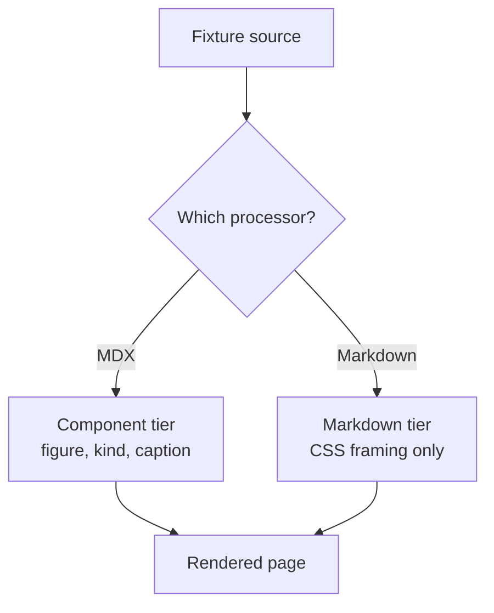
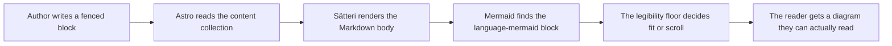
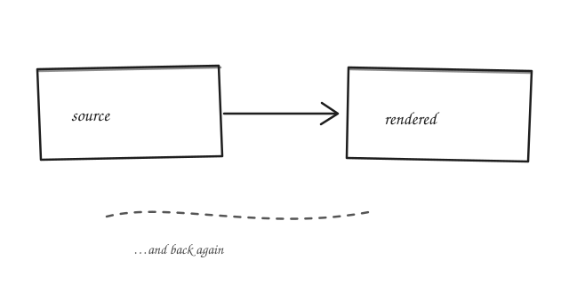

import ArticleImage from '../../../../components/ArticleImage.astro';
import ArticleLinks from '../../../../components/ArticleLinks.astro';
import ImagePair from '../../../../components/ImagePair.astro';
import MediaAside from '../../../../components/MediaAside.astro';
import Video from '../../../../components/Video.astro';
import YouTube from '../../../../components/YouTube.astro';
import testCardWide from './test-card-wide.png';
import testCardPairA from './test-card-pair-a.png';
import testCardPairB from './test-card-pair-b.png';
import testCardTall from './test-card-tall.png';

This is a fixture, not writing. It exists so that the e2e specs which are really
about *rendering* have somewhere to point that is not a published Post, and so
that a rendering regression anywhere on the site has somewhere to show up. It is
`draft: true` forever; `src/lib/production-build.test.ts` owns the guarantee that
a draft never reaches production, so this page is structurally incapable of
leaking. The e2e suite builds with `SHOW_DRAFTS=true`, which is exactly where it
is wanted.

This is the **component tier** of the two-tier figure contract: everything below
that is a figure is emitted by a component, with a kind and a caption. The plain
Markdown tier — images that get equivalent framing through CSS and never become a
`<figure>` — lives in its sibling, `kitchen-sink-markdown`, because `.md` and
`.mdx` do not go through the same processor and a fixture that only exercised one
of them would be measuring half the site.

## TL;DR

- One Post holds one of every block the site can render, so a CSS change has a
  single place to prove itself.
- It is a permanent draft, which is what makes pinning tests to it safe.
- Its prose is placeholder text describing the block below it; nothing here is
  voice-bearing and none of it reaches a reader.
- Its images are synthetic test cards generated for this bundle, so the fixture
  owns its assets outright and no real Post's rename can break a test about CSS.
- Adding a kind of media to the site means adding it here in the same commit.

## Prose blocks

### Headings run to three levels below the title

The Post title is the page's only `h1`. Everything inside the article starts at
`h2`, and the deepest level any Post is expected to reach is `h4`.

#### A fourth-level heading, for the deepest case

Prose carries `inline code`, [an internal link](/posts/), [an external
link](https://docs.astro.build/), **bold**, *italic* and a footnote-ish aside in
parentheses. This paragraph is deliberately long enough to wrap several times at
the reading measure, because vertical rhythm between blocks is only visible once
a block is more than one line tall and the measure is only testable once a line
actually reaches it.

### Lists, flat and nested

An unordered list:

- A first item, short.
- A second item, long enough to wrap at the reading measure so that the hanging
  indent of a wrapped list item is visible and can be asserted against.
- A third item with children:
  - A nested item.
  - Another nested item, which itself has children:
    - A third-level item, the deepest nesting any Post is expected to use.

An ordered list:

1. Step one.
2. Step two, long enough to wrap so that the number stays aligned with the first
   line rather than drifting to the middle of the block.
3. Step three, with nested steps:
   1. A nested step.
   2. Another nested step.

### A blockquote

> A blockquote is a distinct ground, not merely indented prose. It carries body
> text at the same measure, so a treatment that changes the type size here is a
> regression rather than a style.
>
> It can run to more than one paragraph.

### Code, inline and fenced

Inline `npm run verify` sits in the run of text. A fenced block does not:

```sh
npm run verify && gh stack submit --draft=false
```

A fenced block with a long line, which is the case that decides whether code
scrolls inside its own box or pushes the page sideways:

```ts
export function decideRender({ naturalWidth, containerWidth, baseLabelPx, floorPx }: RenderInput): RenderDecision {
  const scale = containerWidth / naturalWidth;
  return baseLabelPx * scale >= floorPx ? { mode: 'fit', renderWidth: containerWidth } : { mode: 'scroll', renderWidth: naturalWidth * (floorPx / baseLabelPx) };
}
```

### A table

Wide enough to be the other half of the horizontal-scroll question:

| Axis | Mechanism | Values | Changes in this pass | Where it is decided |
|---|---|---|---|---|
| Layout | the breakout primitive | `.breakout` at 60rem | no | ADR 0006 |
| Kind | `data-media` | diagram, chart, screenshot, photo, sketch, embed | yes, new | the framing contract ADR |
| Placement | the side attribute | left, right | renamed | the framing contract ADR |

### A horizontal rule

---

Content resumes after the rule, so the rule's own spacing is measurable from
both sides.

## Figures emitted by components

### A constrained single image

The figure contract: a `figure.media` carrying a `data-media` kind, its content
in a body element, and an optional caption. Nothing here says how wide it is —
that is the layout axis, and it is off by default.

<ArticleImage
  src={testCardWide}
  alt="Test card: a wide slate ground with a 100px grid, corner markers and a centre cross"
  kind="photo"
/>

### The same figure, captioned and broken out

Same contract, two axes turned on. The figure runs to the 60rem breakout; the
caption below it stays at the reading measure, because a line of small grey text
at 60rem is unreadable and a caption is text.

<ArticleImage
  src={testCardWide}
  alt="Test card: a wide slate ground with a 100px grid, corner markers and a centre cross"
  kind="photo"
  breakout
  caption="A caption stays at the reading measure however wide the figure above it runs. This one is deliberately long enough to wrap, because a caption that fits on one line proves nothing about its measure."
/>

### A compact pair

<ImagePair images={[
  { src: testCardPairA, alt: 'Test card A: a 4:3 maroon ground with a 100px grid and a centre cross' },
  { src: testCardPairB, alt: 'Test card B: a 4:3 green ground with a 100px grid and a centre cross' },
]} />

### An aside that breaks out, with its media beside the text

<MediaAside
  src={testCardTall}
  alt="Test card: a tall violet ground with a 100px grid, corner markers and a centre cross"
  side="right"
  caption="A caption stays at a readable width even though the figure above it breaks out."
  sourceHref="https://docs.astro.build/en/guides/images/"
  sourceLabel="Data: Astro"
>
  The text column of an aside sits beside its figure on a desktop and above it
  on a phone. This paragraph exists so the column has something to be.

  A second paragraph, so the column is tall enough that the two sides read as a
  pair rather than one dwarfing the other.

  A third, for the same reason. The assertion on this layout is proportional,
  never a pixel budget — text height depends on the font stack, and the CI
  runner's is not this machine's.
</MediaAside>

### A click-to-load embed

Nothing is fetched from Google or YouTube until the reader presses play.

<YouTube id="dQw4w9WgXcQ" title="Fixture clip" poster={testCardWide} />

### Self-hosted video, with a poster and without

The `src` here is the root key uploaded to R2 by hand for exactly this check;
the normal authoring flow colocates media in the bundle and lets `media:sync`
derive the key from its path. No automated test loads the file — Container API
tests cover `<Video />`'s markup, and this page is where a human confirms real
playback on a Preview Deployment.

<Video src="video_sample.mp4" poster={testCardWide} />

A video with no poster falls back to its own first frame rather than being given
a mismatched image:

<Video src="video_sample.mp4" />

## A diagram

A diagram is a figure, not text, so it may break out wider than the reading
measure. The labels below are stable and asserted on — renaming them means
updating `e2e/mermaid.spec.ts` in the same commit.



### A complex diagram, wider than a phone

The one above is the common case and never scrolls. This one cannot be drawn
legibly at 390px — shrinking it to fit would put its labels near 4px — so it
stops shrinking at the legibility floor and scrolls inside its own container.
The page around it does not move. Both cases have to exist here: a fixture with
only simple diagrams would leave the floor's whole reason for existing untested.



## Plain Markdown images inside .mdx

A raster, referenced with plain Markdown syntax rather than a component:


A hand-drawn sketch, exported as SVG and named so the inversion rule finds it:



A plain vector SVG, which is drawn rather than sketched and must not be inverted:


## Links out

<ArticleLinks
  title="Fixture links"
  links={[
    { label: 'Astro documentation', href: 'https://docs.astro.build/', description: 'An external link, which opens in a new tab.' },
    { label: 'All posts', href: '/posts/', description: 'An internal link, which does not.' },
  ]}
/>

## The tail

A closing paragraph, so the last block above is followed by prose rather than by
the end of the article — the spacing below a final figure is a different case
from the spacing between two figures, and both should be visible here.
