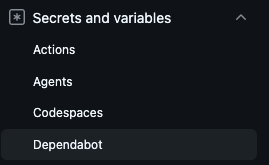

Dependabot had left a couple of PRs open, the major version bumps it won't merge on its own, and I
wanted to look at those on a preview deployment before deciding anything. There was no preview URL
on them. The workflow was green, every step had passed, and nothing whatsoever had been deployed.

Workflows triggered by a Dependabot PR don't read the repository's Actions secrets. They read a
separate store, under Settings → Secrets and variables → **Dependabot**, and until the relevant
secrets are copied over there, every one of them is an empty string. My deploy job checks for the
Cloudflare token and skips with a notice when it isn't set, which is exactly why the run looked
perfectly healthy... a green check mark and a step that quietly decided there was nothing for it to
do.

GitHub treats a Dependabot PR like it came from a fork, with a read-only `GITHUB_TOKEN` and no
access to the Actions secrets. That's a good default, because the code in a dependency update
shouldn't automatically get my deployment credentials, but it also means a preview deployment
needs its own narrowly scoped secret in both stores.



The GitHub CLI can put a secret directly in the Dependabot store:

```sh
gh secret set DEPENDABOT_SECRET_NAME --app dependabot
```

I only want a preview token with the smallest permissions I can give it in that store. Copying a
production token there would make the security boundary a lot less useful.

**Takeaway:** a Dependabot PR's workflow reads secrets from the Dependabot store (something I did now but needed reminding about) rather than the
Actions store, so anything guarded by a token check can pass by doing nothing at all.

## Links

- [Dependabot on Actions](https://docs.github.com/en/code-security/reference/supply-chain-security/dependabot-on-actions/), where GitHub documents the separate secrets store and the fork-like permissions
