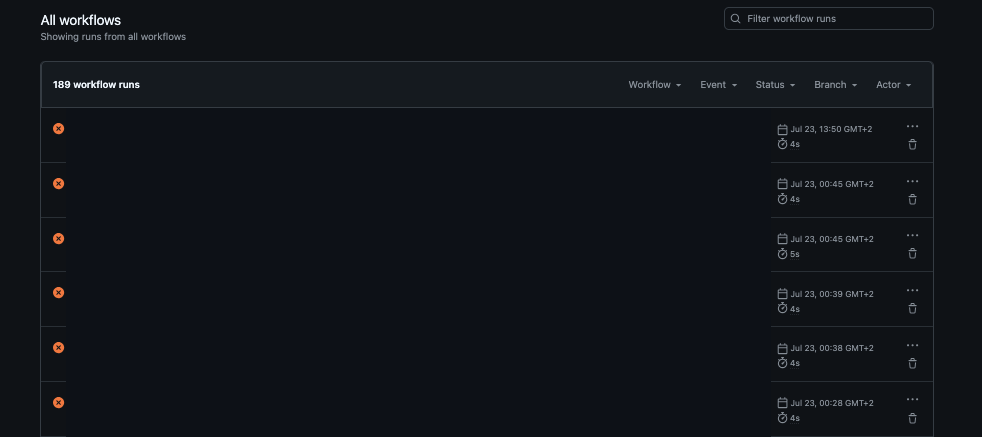

I have an experiment sitting in a private repo, and one day every PR in it just stopped
building 😅 Nothing was wrong with the workflows. I had been pushing a lot, every single PR
ran the long end-to-end tests, and a private repo on the GitHub free plan only gets 2,000 Actions
minutes a month. Public repos run the standard runners for free, with no meter on them at all.



So the long e2e tests only run on main now, and PRs run the fast checks... which is what I should
have done from the beginning. This site's CI has another small guard now too:

```yaml
concurrency:
  group: ${{ github.workflow }}-${{ github.ref }}
  cancel-in-progress: true
```

So a new push to a PR cancels the run for the old commit instead of spending more minutes proving
something I'm not going to merge. The other half of it was looking at how other people handle the
repo behind a personal site, and they're public anyway
([cassidoo/blahg](https://github.com/cassidoo/blahg) is a nice example), so this site's repo went
public too. That lit up branch protection and auto-merge immediately, both of which answer `403:
Upgrade to GitHub Pro or make this repository public` while the repo is private. Auto-merge plus a
required check is what lets Dependabot's minor and patch updates merge themselves.

Flipping a repo public isn't nothing, though. When I opened up [spotify-slack-sync](https://github.com/davelowelarsson/spotify-slack-sync-fredagslistan) I went through it
something like ten times first, looking for anything I didn't want out there.

**Takeaway:** on the free plan a private repo meters Actions minutes and keeps branch protection
behind Pro, so for a personal site whose whole output is public anyway, public is also the cheaper
answer.
